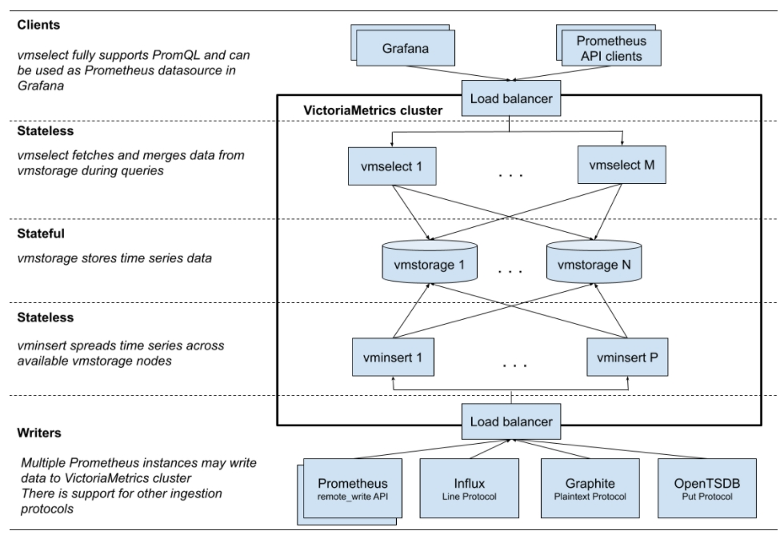

influxdb集群0.11版本后不再开源。

victoriametrics(简称vm)集群开源。


### 一. influxdb的集群实现


meta data: 保存db/retention policy/shardgroups/shard等信息，通过Raft协议，保证强一致；

node data: 保存时序数据，通过hinted handoff队列、anti-entropy机制，保证最终一致；


#### 1. insert流程

* 根据时序数据的时间，按shardGroup存放；

```
// 根据retention pliciy time计算shardGroup时间
func shardGroupDuration(d time.Duration) time.Duration {
	if d >= 180*24*time.Hour || d == 0 { // 6 months or 0
		return 7 * 24 * time.Hour
	} else if d >= 2*24*time.Hour { // 2 days
		return 1 * 24 * time.Hour
	}
	return 1 * time.Hour
}
```

* 每个shardGroup下，保存N个shard；(N>=1)

```
shardN = len(dataNodes)/repliaN;
```

* 每个shard有2个replica；

```
/ # influxd_ctl show-shards
ID      GroupID Database        RetentionPolcy  Replicas        Owners          StartTime                       EndTime
1       1       opsultra        six_month       2               node1:8088,node2:8088  2022-06-27 08:00:00 +0800 CST   2022-07-04 08:00:00 +0800 CST
2       2       opsultra        six_month       2               node2:8088,node3:8088  2022-07-04 08:00:00 +0800 CST   2022-07-11 08:00:00 +0800 CST
```


#### 2. query流程

* API /query执行查询时，可能涉及多个statement，多个statement被顺序执行；(通常只有1个)
* 在执行每个statement时，根据timeRange确定ClusterShardMapping(包含localShardMapping+remoteShardGroup)；
* 执行TSDBB本地查询和TCP远程查询，将结果merge返回给client；


某个shard有N个replica，每个replica都有1个shardOwner，在查询时，如何对多个shardOwner执行查询？

* 随机选择一个shardOwner节点，若可以建立连接，则执行查询；
* 否则，尝试下一个节点，建立连接，执行查询；
* 也就是说，只会查询其中1个shardOwner；


#### 3. hinted handoff队列

influxdb集群场景下，1个shard有N个replcia，通常replica在不同的节点上；写shard时，所有的replica都要写入。

* 当远端的replica写入失败时，会先存储到本机的hinted-handoff队列；
* 本机会定期的将hinted-handoff队列的内容发送给远端节点，达到数据的最终一致；


#### 4. anti-entropy机制

entropy是熵的概念，influxdb会定期检查shard不同副本的熵，若不同，则进行修复。

该配置默认关闭，被开启时：

* **丢失的分片**会自动被修复；
* 内容不一致的分片**需要手动**(通过命令)修复；


### 二. victoriametrics的集群实现


#### 1. 整体架构



集群版的victoriametrics有3类进程，即3类微服务组成：

* vmstorage: 数据存储节点，负责存储时序数据；
* vmselect: 数据查询节点，负责接收用户查询请求，向vmstorage查询时序数据；
* vminsert: 数据插入节点，负责接收用户插入请求，向vmstorage写入时序数据；


集群中vmselect、vminsert节点都是无状态的，唯一有状态的是vmstorage。

vmstorage的多节点采用[shared noting architecture](https://en.wikipedia.org/wiki/Shared-nothing_architecture)，各节点间不共享数据，也不知道彼此的存在。

> `vmstorage` nodes don't know about each other, don't communicate with each other and don't share any data. This is [shared nothing architecture](https://en.wikipedia.org/wiki/Shared-nothing_architecture). It increases cluster availability, simplifies cluster maintenance and cluster scaling.


为保证时序数据的可用性，采用复制的方法，即每份数据存入N个不同的节点，在查询时，同时查询多个节点，去重后返回给client。


#### 2. insert流程

写入数据在vminsert服务中处理，假设--replicationFactor=2，即数据副本=2：


插入时：

* 对每条时序数据，根据其labels计算一致性hash值，作为它存入的目标节点，假设为storageNodeA；

* 对于该条时序数据，由于副本=2，它将被写入storageNodeA和storageNodeA +1两个vmstorage节点；


#### 3. query流程

查询数据在vmselect服务中处理，假设--replicationFactor=2，即数据副本=2：


查询时：

* 向N个vmstorage节点查询时序数据(N为vminsert启动时配置的vmstorage参数)；
* 数据返回后，经过合并去重，返回给client；


#### 4. 节点扩容

vmselect和vminsert节点是无状态的，可以水平扩容。

vmstorage的扩容：

* 启动新vmstorage节点，配置跟老vmstorage节点相同；
* 逐个下线vmselect节点，修改配置(增加storageNode)后启动；
* 逐个下线vminsert节点，修改配置(增加storageNode)后启动；


### 三. 性能对比


#### 1. 测试环境

* influxdb和vm容器部署，单节点；
* 容器资源限制4C8G；
* 测试工具：[tsbs](https://github.com/timescale/tsbs)


#### 2. insert性能

数据格式：

```
cpu,tag1=v1,tag2=v2,...tag10=v10 field1=fv1,filed2=fv2,...,field10=v10
```

数据量：576 w个samples。


结论：vm的insert性能是influxdb的4倍左右。


#### 3. query性能

查询语句：

* 简单的查询：single-groupby-1-1-1

```
## influx
SELECT max(usage_user) from cpu where (hostname = 'host_3609') and time >= '2022-07-01T06:27:46Z' and time < '2022-07-01T07:27:46Z' group by time(1m)

## vm
query=max(max_over_time(cpu_usage_user{hostname='host_295'}[1m]))+by+(__name__)&start=1656661021&end=1656664621&step=60
```


结论：对于简单查询，vm性能比influx高1/3左右。


* 复杂的查询：double-groupby-1，Aggregate on across both time and host, giving the average of 1 CPU metric per host per hour for 24 hours

```
## influx
SELECT mean(usage_user) from cpu where time >= '2022-07-01T07:00:24Z' and time < '2022-07-01T19:00:24Z' group by time(1h),hostname

## vm
query=avg(avg_over_time(cpu_usage_user{}[1h]))+by+(__name__,+hostname)&start=1656658824&end=1656702024&step=3600
```


结论：对于复杂查询，vm的性能比influx高10倍以上。


### 四. 使用对比


#### 1. 易用性

* influx有强大的CLI命令，查询很方便；vm提供了类似于prometheus的查询UI，没有CLI；
* vm的查询支持PromQL，influx不支持；


#### 2. 性能

* vm在insert和query性能上，均优于influx；

* influx的读写容易形成流量热点：
  * influxdb的shard归属于某个node，该shard下所有数据都写入该node；

* vm按hash(labels)确定node，可以分散在多个node上；
  * 但是查询时，要查询多个节点，导致请求数量较多；


