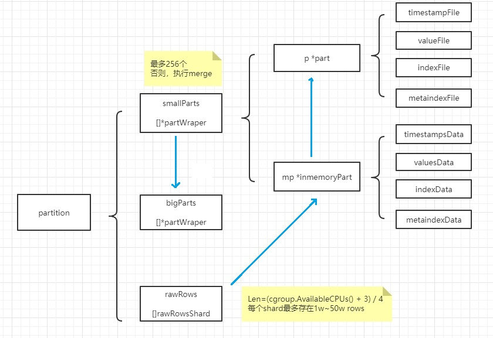

InfluxDB存储引擎目前是TSM(Time Structed Merge Tree)，本质是LSM(Log Strutured Merge Tree)，针对数据查询、压缩、清洗做了优化。


VM存储引擎也是基于LSM，适应写多读少、连续读的场景。


### 一. influxDB的写入


#### 1. 写入


写数据是，写入cache和wal后，就返回client：

* wal保证了宕机重启后，数据可以恢复；
* cache的数据，会被后台的compact线程定期的保存到磁盘；
  * 值得注意的是，cache保存的是原始数据；


#### 2. cache压缩成tsm file

后台线程，每隔1s检查cache是否可以压缩，只要下面其中一个条件满足：

* cache太大了：默认=25MB，可以在配置文件更改；
* 很长时间没有写操作：默认=10min，可以在配置文件更改；

```
func (e *Engine) ShouldCompactCache(t time.Time) bool {
    sz := e.Cache.Size()    
    if sz > e.CacheFlushMemorySizeThreshold {	//CacheFlushMemorySizeThreshold，默认=25MB
        return true
    }
    return t.Sub(e.Cache.LastWriteTime()) > e.CacheFlushWriteColdDuration	//CacheFlushWriteColdDuration，默认=10min
}
```

压缩过程：

* 按照2e6的大小分为N个块，并发进行压缩，压缩后的数据写入tsm file；
  * 由于influxdb的value支持float/int/bool/string等类型，针对不同的数据类型，使用不同的压缩算法；
* 压缩完成后，需要删除wal文件；


压缩算法：

* Timestamp: simple8b算法；
* Float: XOR算法；
* Integer: Zigzag算法；
* String: Snappy算法；
* Bool: 0/1bit存储；


#### 3. tsm file的compact

后台线程，每隔1s检查，检查可以compact的tsm files；

同level的N个tsm file，可以被合并为1个level+1的tsm file；compact减少了文件的个数，提高顺序I/O的读效率；

compact仅涉及数据文件的合并，不涉及压缩。


### 二. vm的写入


#### 1. 数据结构

* partition对应一个目录，存放一个月的数据
* smallParts对应small目录，存放最近写入的数据；
* bigParts对应big目录，存放时间较远的数据；



```
├── big
│   ├── 2022_07
│   │   ├── tmp
│   │   └── txn
│   └── snapshots
├── flock.lock
└── small
    ├── 2022_07
    │   ├── 9198703_147390_20220708021944.621_20220708032254.348_16FF7D342AC6BA17
    │   ├── tmp
    │   └── txn
    └── snapshots
```

```
# ls -alh small/2022_07/9198703_147390_20220708021944.621_20220708032254.348_16FF7D342AC6BA17/
总用量 6.3M
drwxr-xr-x 2 root root  110 7月  19 10:37 .
drwxr-xr-x 5 root root  105 7月  21 18:04 ..
-rw-r--r-- 1 root root 2.0M 7月   8 11:23 index.bin
-rw-r--r-- 1 root root 4.3K 7月   8 11:23 metaindex.bin
-rw-r--r-- 1 root root    2 7月   8 11:23 min_dedup_interval
-rw-r--r-- 1 root root 732K 7月   8 11:23 timestamps.bin
-rw-r--r-- 1 root root 3.6M 7月   8 11:23 values.bin
```


#### 2. 写入和压缩

* 数据写入时，写入内存shard即返回client；
  * 每个shard存放1w~50w条数据

```
func getMaxRawRowsPerShard() int {
    maxRawRowsPerPartitionOnce.Do(func() {
        n := memory.Allowed() / rawRowsShardsPerPartition / 256 / int(unsafe.Sizeof(rawRow{}))
        if n < 1e4 {
            n = 1e4
        }
        if n > 500e3 {
            n = 500e3
        }
        maxRawRowsPerPartition = n
    })
    return maxRawRowsPerPartition
}
```

* shard内数据，每隔1s，以8K rows为一组，将其压缩写入inmemoryPart(内存)；

  * 压缩主要针对timestamp和value，time是[]int64，value是[]float64；
  * 将value的[]float64转换为scale+[]int64；

  ```
  比如，输入：{1.2, 3.4, 5, 6, 7.8}
  	 输出：{12, 34, 50, 60, 78}，scale=-1
  ```

  * 此时，timestamp和value均为[]int64，使用相同的压缩流程：
    * 若[]int64都是相同的值，则保存第一个值即可，header中记录压缩类型=MarshalTypeConst；
    * 若[]int64是delta相同的等差数列，则保存第一个值和delta，header中记录压缩类型=MarshalTypeDeltaConst；
    * 若[]int64的值为Gauge，即随机变化的值，则先计算delta value，然后使用zig-zag压缩；
      * header中记录压缩类型=MarshalTypeZSTDNearestDelta；
      * 结果为：**zig-zag(v0, v1-v0, v2-v1,.....)**
    * 若[]int64的值是Counter，即不断增长的值，则先计算delta of delta，然后使用zig-zag进行压缩；
      * header中记录压缩类型=MarshalTypeZSTDNearestDelta2；
      * 结果为：**zig-zag(v0, v1-v0, (v2-v1)-(v1-v0),.....)**
    * 最后使用[zstd](https://github.com/facebook/zstd)对结果进行二次压缩；
      * zstd是facebook开源的无损的、实时(real-time)的zlib级别的压缩算法；


* inmemoryPart(内存)的数据，每隔5s，以15个inmemoryPart为一组，合并后刷入磁盘的small目录；


#### 3. 合并

定期检查small目录的数据，以15个为一组，合并到1个big目录；

仅涉及数据文件的合并，不涉及压缩。


### 三. 压缩对比


* 压缩率：
  * influxdb对timestamp和value只进行了1次压缩；
  * vm进行两次压缩，第1次是对[]int64的压缩，第2次对第1次压缩的的结果，使用zstd进行2次压缩，压缩率更高；
* 数据文件：
  * influxdb的timestamp和value压缩后保存在一个文件中，格式：k-v-padding::k-v:padding::...，对于对齐的因素，中间需要填充Padding；
  * vm的timestamp压缩后保存在timestamps.bin，value压缩后保存在values.bin，相比influxdb，发挥了列式存储的优势，压缩率更高；

* 数据类型：
  * influxdb的timestamp使用simple8b压缩；value支持float/int/string等类型，对不同的类型使用不同的压缩算法；由于压缩算法的差异，可能达不到最大的压缩效果；
  * vm的timestamp和value统一转换成[]int64进行压缩，压缩时充分考虑各种不同的场景，最大化压缩效率；
* 文件内容：
  * influxdb的tsm file中除了包含timestamp/value数据，还包含index数据；
    * 导致一段时间内的N个tsm file，包含相同的index数据，重复存储；
  * vm的timestamp/value数据文件与index文件分别存储；

