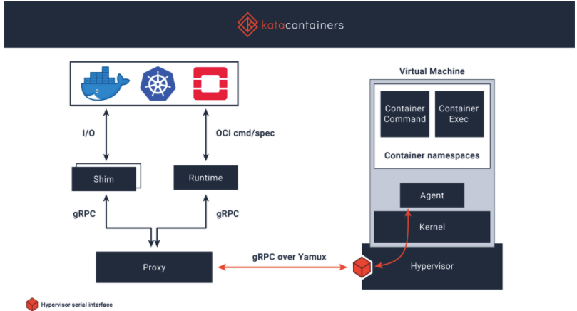
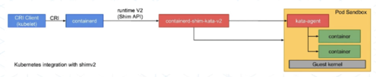
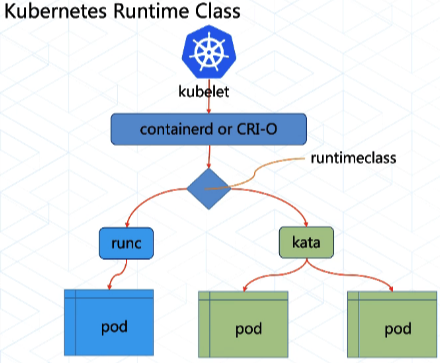

## 一. 容器共享内核存在的问题

在一个节点上，所有container共享同一个OS kernel。

虽然内核参数可以做到namespace级别的隔离，但是仍然有以下问题：

* 容器逃逸：容器里面的进程利用kernel漏洞，获取宿主机root权限，逃出容器隔离；

* 故障影响：一个pod发生kernel panic，会影响整个节点kernel panic，导致节点上其它pod kernel panic；

* 资源竞争：不同pod竞争抢占内核的共享资源，比如锁，可能会产生pod的性能抖动；

  

## 二. kata 安全容器

kata采用精简版的VM，为每个VM分配一个guest kernel，容器运行在VM之中：

* VM层面：由于不同的VM各自使用自己的guest kernel，这样就隔离了内核，也不会产生竞争；
* K8S层面：
  * 每个Pod是一个VM Pod，实现OS层面的隔离，通过Hypervisor管理；
  * 每个Pod通过kubelet和container runtime进行调度管理；

可以看出，kata通过VM与container的结合，实现了：

> fast as container, security as vm.




kata容器被k8s调度(containerd)：

* 每个kata-pod都由一个container-shim-kata-v2的进程管理，该进程负责kata pod的启动/关闭/删除等；
* 每个kata-pod内都有一个kata-agent进程，该进程负载管理Pod中的所有container；




## 三. kata runtime的安装与配置


###1.安装

在[github](https://github.com/kata-containers/kata-containers)的releas中下载kata-2.1.1：kata-static-2.1.1-x86_64.tar.xz，将其解压：

```
tar Cxf / kata-static-2.1.1-x86_64.tar.xz
```

将可执行文件copy至/usr/local/bin:

```
cp /opt/kata/bin/* /usr/local/bin/
```

### 2.配置

配置containerd支持kata-runtime。

编辑containerd的配置，修改以下内容：

```
vi /etc/containerd/config.toml
...
[plugins]
    ......
    [plugins."io.containerd.grpc.v1.cri"]
    ......
        [plugins."io.containerd.grpc.v1.cri".containerd]
        ......
            [plugins."io.containerd.grpc.v1.cri".containerd.runtimes]
               [plugins."io.containerd.grpc.v1.cri".containerd.runtimes.runc]
                  runtime_type = "io.containerd.runc.v2"
                  runtime_engine = ""
                  runtime_root = ""
                  privileged_without_host_devices = false
                  base_runtime_spec = ""
              [plugins."io.containerd.grpc.v1.cri".containerd.runtimes.runc.options]
            [plugins."io.containerd.grpc.v1.cri".containerd.runtimes.kata]
               runtime_type = "io.containerd.kata.v2"
               privileged_without_host_devices = false
...
```

配置完毕后，重启containerd

```
systemctl daemon-reload
systemctl restart containerd
```

### 3.测试

测试containerd使用kata-runtime能够创建container:

```
## 拉取镜像
ctr image pull docker.io/library/busybox:latest
## 启动容器
ctr run -d --runtime io.containerd.kata.v2 docker.io/library/busybox:latest busybox
## 查看容器
ctr container ls
CONTAINER    IMAGE                               RUNTIME
busybox      docker.io/library/busybox:latest    io.containerd.kata.v2
```

测试完毕后，停止并删除容器：

```
ctr task kill busybox
ctr containers rm busybox
```


## 四. kubernetes集成kata runtime

### 1.管理不同的runtime

可以使用kubernetes的runtimeclass资源，管理集群中不同的runtime

* 默认使用runc；
* 若指定runtimeClassName=kata，则使用kata-runtime；



runtimeclass对象：

```
apiVersion: node.k8s.io/v1
handler: kata
kind: RuntimeClass
metadata:
  name: kata-containers
scheduling:
  nodeSelector:
    runtime: kata
```


## 2.创建kata-runtime的pod

创建kata-runtime的pod:

* spec.runtimeClassName: 指定runtime使用kata；

```
apiVersion: v1
kind: Pod
metadata:
  name: my-kata
spec:
  runtimeClassName: kata-containers
  containers:
    - name: uname-kata
      image: busybox
      command: ["/bin/sh", "-c", "uname -r && tail -f /dev/null"]
```


## 参考

1.https://github.com/kata-containers/kata-containers

2.https://github.com/kata-containers/kata-containers/blob/main/docs/install/container-manager/containerd/containerd-install.md

3.https://github.com/wangzheng422/docker_env/blob/dev/redhat/ocp4/4.8/4.8.kata.md

