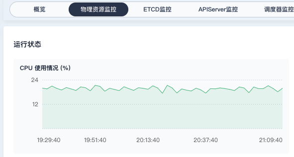

## 一.什么是kubesphere

kubesphere是青云推出的kubernetes管理组件，它运行在kubernete集群之上，提供了监控、devops、服务网格等一系列的上层功能。

青云同时还推出了kubekey工具，用以部署kubenetes和kubesphere：，支持：

* 使用kubekey部署kubernetes；
* 使用kubekey部署kubernetes和kubesphere；


## 二.部署多master的kubesphere

使用kubekey(即kk)工具部署时，它会先部署kubernetes，然后在此基础上，部署kubesphere。

### 1.准备节点

准备3个Centos7.*节点：

```
node1  192.168.1.101
node2  192.168.1.102
node3  192.168.1.103
```

在每个节点上，安装依赖包：

```
yum install -y socat conntrack ebtables ipset
```

### 2.准备kubekey

在首节点上下载kk:

```
export KKZONE=cn
curl -sfL https://get-kk.kubesphere.io | VERSION=v1.1.1 sh -
```

### 3.创建集群配置

使用kk工具，生成集群配置：

```
./kk create config --with-kubernetes v1.20.6 --with-kubesphere v3.1.1
```

其中：

* --with-kubernetes v1.20.6：表示要安装的kubernetes=v1.20.6版本；
* --with-kubesphere v3.1.1：表示安装的kubesphere=v3.1.1版本，若不愿安装kubespher组件，可不提供该参数；

命名执行完毕后，将生成config-sample.yaml文件，修改文件内容：

* 修改hosts中的节点配置；
* 多master环境，需要提供controlPlaneEndpoint中的LB地址，这里仅填写其中一个master的ip；

```
apiVersion: kubekey.kubesphere.io/v1alpha1
kind: Cluster
metadata:
  name: sample
spec:
  hosts:
  - {name: node1, address: 192.168.1.101, internalAddress: 192.168.1.101, user: root, password: ******}
  - {name: node2, address: 192.168.1.102, internalAddress: 192.168.1.102, user: root, password: ******}
  - {name: node3, address: 192.168.1.103, internalAddress: 192.168.1.103, user: root, password: ******}
  roleGroups:
    etcd:
    - node1
    - node2
    - node3
    master:
    - node1
    - node2
    - node3
    worker:
    - node1
    - node2
    - node3
  controlPlaneEndpoint:
    domain: lb.kubesphere.local
    address: "192.168.1.101"
    port: 6443
  kubernetes:
    version: v1.20.6
    imageRepo: kubesphere
    clusterName: cluster.local
  ...
```

### 4.创建集群

使用上一步的集群配置，创建集群：

```
./kk create cluster -f config-sample.yaml
```

该命令执行过程中，会先创建kubernetes集群，然后再安装kubesphere组件；

安装过程中会打印安装日志，除此之外，还可以通用如下命令查看日志：

```
kubectl logs -n kubesphere-system $(kubectl get pod -n kubesphere-system -l app=ks-install -o jsonpath='{.items[0].metadata.name}') -f
```

安装完毕后，会输出kubesphere UI的登录信息：

```
#####################################################
###              Welcome to KubeSphere!           ###
#####################################################
Console: http://192.168.1.101:30880
Account: ****
Password: ****
```

### 5.删除集群

若集群安装过程中，出现错误，可以删除集群，修改配置后，重新安装：

```
## 删除集群
./kk delete cluster -f config-sample.yaml
```


## 三.kubesphere监控组件

安装kubesphere时，会默认安装prometheus的监控组件：

```
# kubectl get pod -n kubesphere-monitoring-system
NAME                                              READY   STATUS    RESTARTS   AGE
alertmanager-main-0                               2/2     Running   0          7d6h
alertmanager-main-1                               2/2     Running   0          7d6h
alertmanager-main-2                               2/2     Running   0          7d6h
kube-state-metrics-577b8b4cf-7wp5w                3/3     Running   0          7d6h
node-exporter-2p7jz                               2/2     Running   0          7d6h
node-exporter-5njs6                               2/2     Running   0          7d6h
node-exporter-6ndb9                               2/2     Running   0          7d6h
notification-manager-deployment-97dfccc89-625b8   1/1     Running   0          7d6h
notification-manager-deployment-97dfccc89-k8767   1/1     Running   0          7d6h
notification-manager-operator-59cbfc566b-4wp9m    2/2     Running   4          7d6h
prometheus-k8s-0                                  3/3     Running   1          4d4h
prometheus-k8s-1                                  3/3     Running   1          4d4h
prometheus-operator-8f97cb8c6-dq4d2               2/2     Running   0          7d6h
```

kubesphere的监控组件，使用prometheus-operator来管理prometheus的各种prometheusrule、serviceMonitor等各种CRD对象及其状态变化。

具体部署的prometheus、alertmanager的副本数，在ks-installer中指定：

prometheus的副本数：

* 若节点数<3，则默认prometheus副本数=1；
* 若节点数>=3，则默认prometheus副本数=2；

```
// ks-installer/roles/ks-monitor/template/prometheus-prometheus.yaml.j2

  replicas: {{ monitoring.prometheus.replicas | default(monitoring.prometheusReplicas) | default(1) }}

  replicas: {{ monitoring.prometheus.replicas | default(monitoring.prometheusReplicas) | default(2) }}

```

alertmanager的副本数：

* 若节点数<3，则默认alertmanager副本数=1;
* 若节点数>=3，则默认alertmanager副本数=3；

```
// ks-installer/roles/ks-monitor/template/alertmanager-alertmanager.yaml.j2

  replicas: {{ monitoring.alertmanager.replicas | default(monitoring.alertmanagerReplicas) | default(1) }}

  replicas: {{ monitoring.alertmanager.replicas | default(monitoring.alertmanagerReplicas) | default(3) }}

```


## 四.kubesphere监控API

以kubesphere上监控集群CPU使用情况为例：



### 1.前端调用：

```
GET http://192.168.1.101:30880/kapis/monitoring.kubesphere.io/v1alpha3/cluster?start=1653737380&end=1653743380&step=120s&times=50&metrics_filter=cluster_cpu_utilisation
```

可以看到，指标名称为cluster_cpu_utilisation。

###2.后端代码：

API 注册的代码:

```
// kubesphere/pkg/kapis/monitoring/v1alpha3/register.go
func AddToContainer(c *restful.Container, ...) error {
...
		ws.Route(ws.GET("/cluster").
			To(h.handleClusterMetricsQuery).
			Doc("Get cluster-level metric data.").
			Param(ws.QueryParameter("metrics_filter", "The metric name filter consists of a regexp pattern. It specifies which metric data to return. For example, the following filter matches both cluster CPU usage and disk usage: `cluster_cpu_usage|cluster_disk_size_usage`. View available metrics at [kubesphere.io](https://docs.kubesphere.io/advanced-v2.0/zh-CN/api-reference/monitoring-metrics/).").DataType("string").Required(false)).
			Param(ws.QueryParameter("start", "Start time of query. Use **start** and **end** to retrieve metric data over a time span. It is a string with Unix time format, eg. 1559347200. ").DataType("string").Required(false)).
			Param(ws.QueryParameter("end", "End time of query. Use **start** and **end** to retrieve metric data over a time span. It is a string with Unix time format, eg. 1561939200. ").DataType("string").Required(false)).
			Param(ws.QueryParameter("step", "Time interval. Retrieve metric data at a fixed interval within the time range of start and end. It requires both **start** and **end** are provided. The format is [0-9]+[smhdwy]. Defaults to 10m (i.e. 10 min).").DataType("string").DefaultValue("10m").Required(false)).
			Param(ws.QueryParameter("time", "A timestamp in Unix time format. Retrieve metric data at a single point in time. Defaults to now. Time and the combination of start, end, step are mutually exclusive.").DataType("string").Required(false)).
			Metadata(restfulspec.KeyOpenAPITags, []string{constants.ClusterMetricsTag}).
			Writes(model.Metrics{}).
			Returns(http.StatusOK, respOK, model.Metrics{})).
			Produces(restful.MIME_JSON)
...
}
```

API handler的代码：

```
// kubesphere/pkg/kapis/monitoring/v1alpha3/handler.go
func (h handler) handleClusterMetricsQuery(req *restful.Request, resp *restful.Response) {
	params := parseRequestParams(req)
	opt, err := h.makeQueryOptions(params, monitoring.LevelCluster)
	if err != nil {
		api.HandleBadRequest(resp, nil, err)
		return
	}
	h.handleNamedMetricsQuery(resp, opt)
}
```

具体查询时，它会向prometheus发送metric的查询：

* 查询表达式：makeExpr(metric, *ops)，这里metric=cluster_cpu_utilisation；
* 执行查询：p.client.QueryRange(...)，向prometheus发起查询；

```
// kubesphere/pkg/simple/client/monitoring/prometheus/prometheus.go
func (p prometheus) GetNamedMetricsOverTime(metrics []string, start, end time.Time, step time.Duration, o monitoring.QueryOption) []monitoring.Metric {
  var res []monitoring.Metric
  ...
	timeRange := apiv1.Range{
		Start: start,
		End:   end,
		Step:  step,
	}
	for _, metric := range metrics {
		wg.Add(1)
		go func(metric string) {
			parsedResp := monitoring.Metric{MetricName: metric}
			//查询prometheus
			value, _, err := p.client.QueryRange(context.Background(), makeExpr(metric, *opts), timeRange) 
			parsedResp.MetricData = parseQueryRangeResp(value, genMetricFilter(o))
			...
			res = append(res, parsedResp)
			wg.Done()
		}(metric)
	}
	wg.Wait()
	return res
}
```

重点看一下如何构造查询表达式：

```
// kubesphere/pkg/simple/client/monitoring/prometheus/promql.go
var promQLTemplates = map[string]string{
	//cluster
	"cluster_cpu_utilisation":            ":node_cpu_utilisation:avg1m",
	...
}
func makeExpr(metric string, opts monitoring.QueryOptions) string {
	tmpl := promQLTemplates[metric]
	switch opts.Level {
	case monitoring.LevelCluster:
		return tmpl
	...
}
```

对于前端查询的cluster_cpu_utilisation，发给prometheus的是":node_cpu_utilisation:avg1m"，prometheus上这样一条表达式规则：

```
- expr: |
    avg(irate(node_cpu_used_seconds_total{job="node-exporter"}[5m]))
  record: :node_cpu_utilisation:avg1m
```

所以，cluster_cpu_utilisation指标最终是执行如下promql的查询结果：

```
avg(irate(node_cpu_used_seconds_total{job="node-exporter"}
```


## 参考：

1.https://v3-1.docs.kubesphere.io/zh/docs/installing-on-linux/introduction/multioverview/

2.https://kubesphere.com.cn/forum/d/5271-etcd