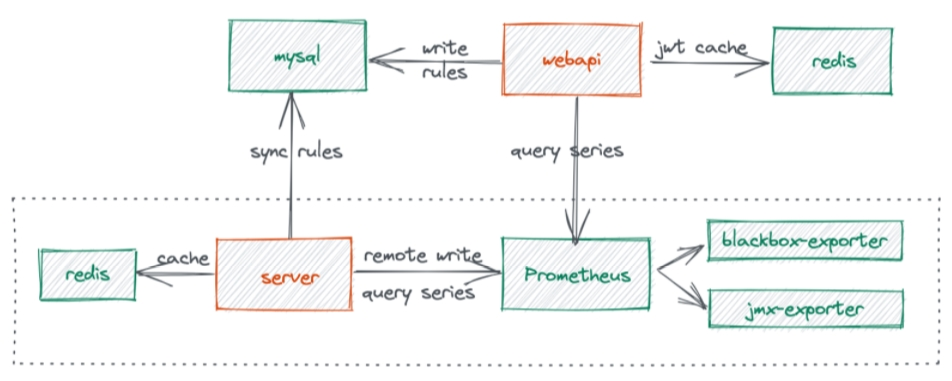

### n9e是什么

n9e的全称是[Nightingale](https://github.com/didi/nightingale)，与开发Open-falcon的是一拨人，后来这波人去了滴滴，开发了n9e成为滴滴开源的监控框架。

n9e在v5版本之前，延续了Open-falcon push的模式，在告警的业务逻辑和指标展现做了很多优化。

n9e在v5版本至今，使用prometheus作为后端的TSDB，并通过promQL作为告警表达式做告警判定。


本文主要分析最新的v5版本。


### n9e的整体架构



- server：后端服务，负责将指标写入Prometheus，以及告警业务逻辑的实现；
- webapi：前端服务，负责前端业务逻辑；
- mysql：保存告警策略，以及告警通知配置；
- redis：缓存用户登录信息；


指标的业务逻辑：

1. 监控agent通过remote-write API，请求server；
2. server对指标进行提取，存入Prometheus；


告警的业务逻辑：

1. 用户通过webapi配置告警策略，server将策略保存至mysql；
2. server根据告警周期，定期查询PromQL的值是否触发告警；
3. 若触发告警，则将其存入mysql，同时进行告警通知；


### n9e的部署和使用

使用[部署文档](https://n9e.github.io/quickstart/standalone/)，部署单机版的n9e环境，主要部署以下组件：

* prometheus
* mysql
* redis
* n9e server & webapi


部署成功后，n9e server监听在19000端口，webapi监听到18000端口；

通过http://ip:18000访问WEB UI，默认用户：root/root.2020


### prometheus作为后端TSDB

prometheus通常被用来拉取exporter的指标，然后存入本地磁盘；它既实现了拉取的逻辑，也实现TSDB的功能。

在2.25版本之前，prometheus不支持单独作为TSDB，即**不支持**通过API直接向prometheus写入时序数据。

在2.25版本之后，prometheus配置--enable-feature=remote-write-receiver参数后，支持通过REST接口向prometheus写入时序数据。


n9e使用prometheus 2.28版本，利用了prometheus这一特性，将其作为后端的TSDB。


prometheus提供的REST接口：POST /api/v1/write，可以向prometheus写入时序数据；

查看prometheus的源码：

```go
// web/api/v1/api.go
func (api *API) Register(r *route.Router) {
    ...
    r.Post("/write", api.ready(api.remoteWrite))
    ......
}

func (api *API) remoteWrite(w http.ResponseWriter, r *http.Request) {
    if api.remoteWriteHandler != nil {
        api.remoteWriteHandler.ServeHTTP(w, r)
    } else {    //未配置remote-write-receiver，返回错误
        http.Error(w, "remote write receiver needs to be enabled with --enable-feature=remote-write-receiver", http.StatusNotFound)
    }
}
```


### telegraf作为监控agent并自动发现

> Telegraf 是 InfluxData 开源的一款采集器，可以采集操作系统、各种中间件的监控指标等；
>
> Telegraf是一个大一统的设计，即一个二进制可以采集CPU、内存、mysql、mongodb、redis、snmp等，不像Prometheus的exporter，每个监控对象一个exporter。

telegraf作为监控agent被部署到监控的目标主机上，同时配置telegraf，将其采集的指标输出到n9e server:

```shell
vi /opt/telegraf/telegraf.conf
......
[[outputs.opentsdb]]
  host = "http://127.0.0.1"
  port = 19000
  http_batch_size = 50
  http_path = "/opentsdb/put"
  debug = false
  separator = "_"
```

上述配置，telegraf采集的指标，通过http://127.0.01:19000/opentsdb/put发到n9e server，该配置中telegraf与n9e server部署在一台机器上。


n9e server实现了/opentsdb/put接口，相关的源码：

```go
// src/server/router/router.go
func configRoute(r *gin.Engine, version string) {
    ...
    r.POST("/opentsdb/put", handleOpenTSDB)
    ...
}
func handleOpenTSDB(c *gin.Context) {
    ...
    bs, err = ioutil.ReadAll(c.Request.Body)
    var arr []HTTPMetric
    err = json.Unmarshal(bs, &arr)
    for i := 0; i < len(arr); i++ {
        pt, err := arr[i].ToProm()
        host, has := arr[i].Tags["ident"]
        // 有ident标签
        if has {
            // register host
            ids[host] = ts
        }
        list = append(list, pt)
    }
    if len(list) > 0 {
        if !writer.Writers.PushQueue(list) {    //将时序push到queu
            msg = "writer queue full"
        }
        // 将host注册进去
        idents.Idents.MSet(ids)
    }
    ...
}
```

该API所做的事情：

* 提供指标中的ident标签，其value作为**新发现的host**，被注册到已管理主机列表；
* 将接收的指标push到本地的Queue，Queue中的数据后面被goroutine发送到prometheus；


### grafana-agent作为监控agent并自动发现

grafana-agent可以拉取各种exporter的/metrics，并将其通过remote-write API写入n9e server。

grafana-agent还内置了常用的exporter，比如node-exporter。

grafana-agent的配置文件：

```shell
# cat agent.yaml
server:
  http_listen_port: 12345
metrics:
  wal_directory: /tmp/grafana-agent-wal
  global:
    scrape_interval: 15s
    external_labels:
      cluster: mycluster
    remote_write:
    - url: http://172.1.2.3:19000/api/v1/write
    scrape_configs:
    - job_name: "cadvisor"
      static_configs:
      - targets: ['192.168.1.2:19000']
integrations:
  agent:
    enabled: true
  node_exporter:
    enabled: true
```

上述配置中：

* grafana-agent基础了node_exporter；
* grafana-agent拉取cadvisor任务的/metrics；
* grafana-agent将采集的指标通过remote-write发送到n9e server；
* n9e server接收到指标后，提取其中的instance label，其value作为**新发现的host**，添加到发现的主机列表中；


### 参考

1. 部署: https://n9e.github.io/quickstart/standalone/

2. prometheus remote-write-receiver: https://prometheus.io/docs/prometheus/latest/querying/api/#remote-write-receiver
3. grafana-agent docs: https://grafana.com/docs/grafana-cloud/kubernetes/agent-k8s/k8s_agent_metrics/