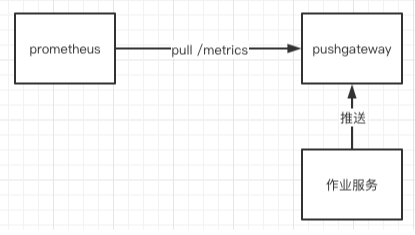
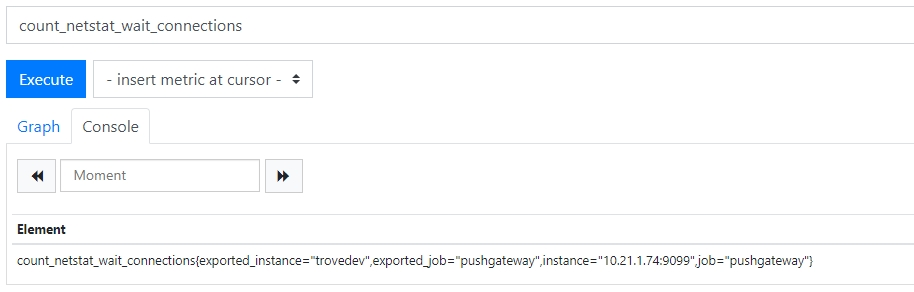

## 一.Pushgateway是什么

pushgatway是prometheus社区推出的一个推送指标的组件，主要应用在：

* 短生命周期(short-lived)或者批任务(batch jobs)的资源/作业的指标；
* prometheus无法拉取到(网络原因)的target的指标；



作业任务可以将指标通过HTTP API推送给pushgateway，然后由prometheus拉取pushgateway的指标。


## 二.Pushgateway如何使用

### 1.安装启动pushgateway

```
# wget https://github.com/prometheus/pushgateway/releases/download/v1.2.0/pushgateway-1.2.0.linux-amd64.tar.gz
# ./pushgateway --web.listen-address=":9099"
```

### 2.配置pushgateway被prometheus拉取

```
scrape_configs：  
  - job_name: 'pushgateway'
    static_configs:
    - targets: ['127.0.0.1:9099']
```

### 3.向pushgateway发送数据

这里通过shell，调用pushgateway的HTTP接口，发送数据：

```
#!/bin/bash
instance_name=`hostname -f | cut -d'.' -f1`

if [ $instance_name == "localhost" ];then
  echo "Must FQDN hostname"
  exit 1
fi

# For waitting connections
label="count_netstat_wait_connections"
count_netstat_wait_connections=`netstat -an | grep -i wait | wc -l`

cat <<EOF | curl --data-binary @- http://127.0.0.1:9099/metrics/job/pushgateway/instance/$instance_name
# TYPE $label gauge
# HELP $label current connection in wait state
$label $count_netstat_wait_connections
EOF
```

查询本机中处于wait状态的网络连接数，然后发送给pushgateway:

```
# ./net_exporter_shell.sh
```

### 4.prometheus UI验证数据正确接收&拉取

首先，看一下pushgateway的/metrics是否有我们定义的指标：

```
# curl http://127.0.0.1:9099/metrics
# HELP count_netstat_wait_connections current connection in wait state
# TYPE count_netstat_wait_connections gauge
count_netstat_wait_connections{instance="trovedev",job="pushgateway"} 0
...
```

然后，再看prometheus UI上是否可以查询到该指标：




## 三.Pushgateway的源码分析

pushgateway的源码：https://github.com/prometheus/pushgateway

### 1.指标推送的API: 

```
// pushgateway/main.go
func main() {
	...
	// Handlers for pushing and deleting metrics.
	pushAPIPath := *routePrefix + "/metrics"
	for _, suffix := range []string{"", handler.Base64Suffix} {
		jobBase64Encoded := suffix == handler.Base64Suffix
		// URL中的labels被解析为jobname，instance
		r.Post(pushAPIPath+"/job"+suffix+"/:job/*labels", handler.Push(ms, false, !*pushUnchecked, jobBase64Encoded, logger))
		...
	}
	...
}
```

推送的逻辑在handler.Push(...)

```
// pushgateway/handler/push.go
func Push(
	ms storage.MetricStore,
	replace, check, jobBase64Encoded bool,
	logger log.Logger,
) func(http.ResponseWriter, *http.Request) {
	handler := http.HandlerFunc(func(w http.ResponseWriter, r *http.Request) {
		job := route.Param(r.Context(), "job")
		// 解析URL中labels
		labelsString := route.Param(r.Context(), "labels")
		labels, err := splitLabels(labelsString)
		labels["job"] = job
		// 解析request body中的text，解析成prom格式的metric
		var parser expfmt.TextParser
		metricFamilies, err = parser.TextToMetricFamilies(r.Body)
		
		if !check {
			// 将指标存入到storage.MetricStore
			ms.SubmitWriteRequest(storage.WriteRequest{
				Labels:         labels,
				Timestamp:      now,
				MetricFamilies: metricFamilies,
				Replace:        replace,
			})
			w.WriteHeader(http.StatusAccepted)
			return
		}
	}
	instrumentedHandler := promhttp.InstrumentHandlerRequestSize(
		httpPushSize, promhttp.InstrumentHandlerDuration(
			httpPushDuration, InstrumentWithCounter("push", handler),
		))

	return func(w http.ResponseWriter, r *http.Request) {
		mtx.Lock()
		instrumentedHandler.ServeHTTP(w, r)
	}
}
```

看一下storage.MetricStore存储指标的逻辑：

```
// pushgateway/storage/diskmetricstore.go
func (dms *DiskMetricStore) SubmitWriteRequest(req WriteRequest) {
	dms.writeQueue <- req	// 写入channel
}
```

dms中有一个loop处理channel中的数据：

```
// pushgateway/storage/diskmetricstore.go
func (dms *DiskMetricStore) loop(persistenceInterval time.Duration) {
	...
	for {
		select {
		case wr := <-dms.writeQueue:
			lastWrite = time.Now()
			if dms.checkWriteRequest(wr) {
				dms.processWriteRequest(wr)
			} 
		...
	}
}
```

```
// pushgateway/storage/diskmetricstore.go
func (dms *DiskMetricStore) processWriteRequest(wr WriteRequest) {
	key := groupingKeyFor(wr.Labels)
	group, ok := dms.metricGroups[key]
	if !ok {
		group = MetricGroup{
			Labels:  wr.Labels,
			Metrics: NameToTimestampedMetricFamilyMap{},
		}
		dms.metricGroups[key] = group
	} 
	...
}
```

可以看到，指标最终被写入dms.metricGroups中，它是一个map结构：

```
// pushgateway/storage/diskmetricstore.go
type DiskMetricStore struct {
	...
	metricGroups    GroupingKeyToMetricGroup
}
// 内存的map结构
type GroupingKeyToMetricGroup map[string]MetricGroup
```


### 2.指标查询的API：/metrics

```
// pushgateway/main.go
func main() {
	...
	r.Get("/metrics", wrap("api/v1/metrics", api.metrics))	
}
```

API的handler处理：

* 从metricStorage中获取所有的指标；
* 将指标组装后返回client；

```
// pushgateway/api/v1/api.go
func (api *API) metrics(w http.ResponseWriter, r *http.Request) {
	// 从storage.MetricStorage中获取所有的
	familyMaps := api.MetricStore.GetMetricFamiliesMap()
	res := []interface{}{}
	for _, v := range familyMaps {
		metricResponse := map[string]interface{}{}
		for name, metricValues := range v.Metrics {
			....
		}
		res = append(res, metricResponse)
	}
	api.respond(w, res)		// 返回client
}
```

查DiskMetricStore的时候，查询的是里面的metricGroups内容，也是上一步中我们push指标的目的地：

```
// pushgateway/storage/diskmetricstore.go
func (dms *DiskMetricStore) GetMetricFamiliesMap() GroupingKeyToMetricGroup {
	...
	groupsCopy := make(GroupingKeyToMetricGroup, len(dms.metricGroups))
	for k, g := range dms.metricGroups {
		...
	}
	return groupsCopy
}
```


### 3.总结

* 推送指标：最新的指标被存入DiskMetricStore.metricGroup；
* 查询指标：查询DiskMetricStore.metricGroup中最新的值；


## 四.Pushgateway的最佳实践

pushgateway官方强调的是，不能使用pushgateway将prometheus变成一个push模型：

> First of all, the Pushgateway is not capable of turning Prometheus into a push-based monitoring system.

pushgateway官方认为，pushgateway的最佳用途是：抓取服务层的批任务的指标

* 服务层的批任务：sevice-level batch job，意味着它跟具体instance/job都无关；

> **Usually, the only valid use case for the Pushgateway is for capturing the outcome of a service-level batch job**. A "service-level" batch job is one which is not semantically related to a specific machine or job instance (for example, a batch job that deletes a number of users for an entire service).

此外，pushgateway在使用时，有一些缺点。

### 1. pushgateway的使用缺点一

当作业服务不再向pushgateway推送指标时，仍然可以从pushgateway的/metrics接口中，查询到过期的数据。

比如：

* targetA在12:01:00向pushgateway推送metricA指标；
* targetA在12:01:10服务宕机，不再推送指标；
* 通过pushgateway的/metrics接口：
  * 在12:01:10之后，仍然可以查到metricA指标，一直不会过期；
  * 即12:02:00、12:03:00、...、12:30:00都可以查询到metricA指标；

为了解决这个问题，可以通过pushgateway的Delete接口，主动删除该target的指标，这样/metrics接口就查不到了：

```
curl -X DELETE http://127.0.0.1:9099/metrics/job/some_job/instance/some_instance
```

### 2. pushgateway的使用缺点二

假设target上报指标的时间=t1，prometheus拉取pushgatway的时间=t2，无法保证t1和t2在同一个拉取周期中，也就是无法保证prometheus可以拉取到最新的数据。

比如：

* target的上报周期=30s，最近一次在12:00:20上报，下一次在12:00:50上报；
* prometheus的拉取周期=30s，最近一次在12:00:10拉取，下一次在12:00:40拉取；
* 也就是说，prometheus拉取的总是target上个周期的数据；


## 参考

1.https://prometheus.io/docs/practices/pushing/

2.https://github.com/prometheus/pushgateway

