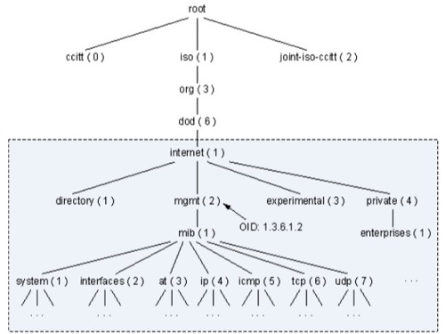
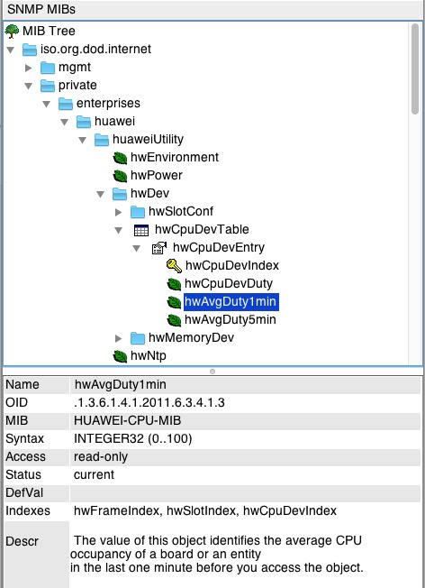

## 一. SNMP协议 ##


### 1. SNMP协议版本 ### 

* v1/v2c: 基于community进行认证；
* v3: 增强认证方式，增加了用户、安全级别等；


### 2. MIB(Management Information Base)树结构 ### 

MIB以树状结构进行存储，树的叶子节点表示管理对象，它可以通过根节点开始的一条唯一路径来识别，即OID(Object Identifier)。



如上图所示，system对象可以表示为：{ iso(1) org(3) dod(6) internet(1) mgmt(2) mib(1) system(1) }，简单标记为:1.3.6.1.2.1.1，这种标识就叫做OID。


MIB分为公有MIB和私有MIB两种：

* 公有MIB：一般由RFC定义，大部分设备制造商都按照RFC的定义来提供SNMP接口，比如system对象，常用于描述系统对象，约定用1.3.6.1.2.1.1表示；
* 私有MIB：由设备制造商自己定义，比如{ iso(1) org(3) dod(6) internet(1) private(4) enterprise(1) huawei(2011) }，华为的oid通常定义在1.3.6.1.4.1.2011下面；


## 二. SNMP环境配置 ## 


设备上运行一个snmpd进程，监听在UDP的161端口，client通过snmpget、snmpwalk等命令，使用oid可以访问到目标节点对应的数据；

当设备上有告警触发时，可以通过trap向外部的snmptrapd进程发送出来，snmptrapd通常监听在UDP的161端口；


### 1. snmpd ### 

可以在linux上部署snmpd进程：

```
# yum install net-snmp -y

# systemctl status snmpd
● snmpd.service - Simple Network Management Protocol (SNMP) Daemon.
   Loaded: loaded (/usr/lib/systemd/system/snmpd.service; disabled; vendor preset: disabled)
   Active: active (running) since 二 2023-05-23 14:23:50 CST; 2s ago
 Main PID: 13978 (snmpd)
    Tasks: 1
   Memory: 8.9M
   CGroup: /system.slice/snmpd.service
           └─13978 /usr/sbin/snmpd -LS0-6d -f

5月 23 14:23:48 trovedev systemd[1]: Starting Simple Network Management Protocol (SNMP) Daemon....
5月 23 14:23:50 trovedev snmpd[13978]: NET-SNMP version 5.7.2
5月 23 14:23:50 trovedev systemd[1]: Started Simple Network Management Protocol (SNMP) Daemon..
```

snmpd运行后，会监听在161端口：

```
# netstat -nalp|grep 161
udp        0      0 0.0.0.0:161             0.0.0.0:*                           13978/snmpd
```

snmpd的配置文件：/etc/snmp/snmpd.conf


### 2. snmp client ###

client工具：

* CLI命令：snmpget、snmpwalk等；
* MIB Browser: https://ireasoning.com/download.shtml


snmpget命令查询sysDescr信息，其oid=.1.3.6.1.2.1.1.1.

```
# snmpget -v 2c -c public 10.21.1.74 .1.3.6.1.2.1.1.1.0
SNMPv2-MIB::sysDescr.0 = STRING: Linux trovedev 3.10.0-1160.59.1.el7.x86_64 #1 SMP Wed Feb 23 16:47:03 UTC 2022 x86_64
```

MIB Browser工具查询sysDescr信息：


### 3. mib文件 ### 

公有的mib，以sysDescr为例，其oid为{ iso(1) org(3) dod(6) internet(1) mgmt(2) mib(1) system(1)  sysDescr(1)}:

* { system 1} 定义了：sysDescr的父节点为system，而sysDescr位于system下的第1个节点

```
sysDescr OBJECT-TYPE
    SYNTAX      DisplayString (SIZE (0..255))
    MAX-ACCESS  read-only
    STATUS      current
    DESCRIPTION
            "A textual description of the entity.  This value should
            include the full name and version identification of
            the system's hardware type, software operating-system,
           and networking software."
      ::= { system 1 }
```


私有的mib，以huawei s5700交换机的cpu使用率为例：

```
{
	"modelNumber" :  "HUAWEI_S5720",
  "metrics" : {
  	"cpu使用率(%)"  : {
    	"oid" : ".1.3.6.1.4.1.2011.6.3.4.1.3.0.1.0",
			"metricname": "switch.cpu.used.percent"
    }
  }
}
```

它的oid hwAvgDuty1min（.1.3.6.1.4.1.2011.6.3.4.1.3）在MIB Browser中为：



它的定义在华为提供的mib文件（HUAWEI-CPU-MIB.mib）中


mib文件可以被加载到snmpd中，这样在执行snmpget、snmpwalk命令时，不用再指定具体的oid数值，输入mib模块名称+oid名称即可。

mib文件加载方法：

* 查询mib文件存放路径
* 将mib文件保存到目标路径
* snmpget/snmpwalk校验

```
## 1. 查询mib的存放路径
# net-snmp-config --default-mibdirs
/root/.snmp/mibs:/usr/share/snmp/mibs

## 2. 将mib文件保存到目录路径
# ls -alh /root/.snmp/mibs/
总用量 56K
drwxr-xr-x 2 root root   61 5月  24 10:40 .
drwxr-xr-x 3 root root   18 5月  24 10:37 ..
-rw-r--r-- 1 root root 9.0K 5月  24 10:40 NET-SNMP-EXTEND-MIB.mib
-rw-r--r-- 1 root root  44K 5月  24 10:40 UCD-SNMP-MIB.mib

## 3. snmpwalk校验
# snmpwalk -v 2c -c public localhost UCD-SNMP-MIB::laLoad
UCD-SNMP-MIB::laLoad.1 = STRING: 0.21
UCD-SNMP-MIB::laLoad.2 = STRING: 0.10
UCD-SNMP-MIB::laLoad.3 = STRING: 0.09
```


## 三. snmpd.conf配置 ##


/etc/snmpd/snmpd.conf是snmpd进程的配置文件，常用的配置包含：

* rw权限配置
* 静态oid和动态oid配置


### 1. 读写权限配置

默认情况下，snmpd只允许访问sytemview的oid，即.1.3.6.1.2.1下面的oid:

```
#       group          context sec.model sec.level prefix read   write  notif
access  notConfigGroup ""      any       noauth    exact  systemview none none

# Make at least  snmpwalk -v 1 localhost -c public system fast again.
#       name           incl/excl     subtree         mask(optional)
view    systemview    included   .1.3.6.1.2.1.1
view    systemview    included   .1.3.6.1.2.1.25.1.1
```

为了方便，我们将其修改为：**可以访问所有**

*  下面的view all可以访问.1下面的所有oid；

```
#       group          context sec.model sec.level prefix read   write  notif
access  notConfigGroup ""      any       noauth    exact  all none none

# Make at least  snmpwalk -v 1 localhost -c public system fast again.
#       name           incl/excl     subtree         mask(optional)
view    all           included   .1
```

配置完毕后，重启snmpd服务：

```
# systemctl start snmpd
# systemctl status snmpd
```

使用snmpwalk命令，校验oid是否可以成功读取：

```
# snmpwalk -v 2c -c public localhost .1.3.6.1.4.1.2021.10.1.3
UCD-SNMP-MIB::laLoad.1 = STRING: 0.24
UCD-SNMP-MIB::laLoad.2 = STRING: 0.16
UCD-SNMP-MIB::laLoad.3 = STRING: 0.14
```


### 2. 静态oid配置 ### 

静态OID是指在snmpd中预定义的oid，它的值是固定的，比如设备的名称、软件版本等。

比如，在/etc/snmp/snmpd.conf中配置：

```
# sysDescr可以设置设备的描述信息
sysDescr My Device, Version 1.0, running on Linux 2.6.32-696.el6.x86_64

# 设置SNMP代理的联系人信息
sysContact Admin <admin@example.com>
```

配置完成后，重启snmpd，再用snmpget上述静态oid:

```
# snmpget -v 2c -c public localhost sysDescr.0
SNMPv2-MIB::sysDescr.0 = STRING: My Device, Version 1.0, running on Linux 2.6.32-696.el6.x86_64

# snmpget -v 2c -c public localhost sysContact.0
SNMPv2-MIB::sysContact.0 = STRING: Admin <admin@example.com>
```


### 3. 动态oid配置 ### 

动态oid是指snmpd中动态生成的oid，它的值是根据设备状态、性能指标等实时计算得出来的。

动态oid的实现方式，在snmpd.conf主要有两种：

* extend
* pass


#### 1) extend配置 ####

通过extend关键字，在/etc/snmp/snmpd.conf中配置一个脚本，其格式为：

```
extend [MIBOID] NAME PROG ARGS
```

其中，MIBOID是可选参数，若**未指定MIBOID**，则：

* 其命令行内容保存在NET-SNMP-EXTEND-MIB::nsExtendConfigTable；
* 其执行结果保存在NET-SNMP-EXTEND-MIB::nsExtendOutput1Table；


比如，在/etc/snmp/snmpd.conf中配置extend一个shell脚本：

```
extend connCount /bin/bash /etc/tcpconn.sh
```

其中，/etc/tcpconn.sh用于采集建立的tcp连接数：

```
# cat /etc/tcpconn.sh
#!/bin/sh
conn=`netstat -s -t | grep connections\ established |awk '{print $1}'`
echo $conn
```


重启snmpd后，通过snmpwalk查询命令行内容及执行结果。

snmpwalk查询命令行参数：

```
# snmpwalk -v 2c -c public localhost NET-SNMP-EXTEND-MIB::nsExtendConfigTable
NET-SNMP-EXTEND-MIB::nsExtendCommand."connCount" = STRING: /bin/bash
NET-SNMP-EXTEND-MIB::nsExtendArgs."connCount" = STRING: /etc/tcpconn.sh
NET-SNMP-EXTEND-MIB::nsExtendInput."connCount" = STRING:
NET-SNMP-EXTEND-MIB::nsExtendCacheTime."connCount" = INTEGER: 5
NET-SNMP-EXTEND-MIB::nsExtendExecType."connCount" = INTEGER: exec(1)
NET-SNMP-EXTEND-MIB::nsExtendRunType."connCount" = INTEGER: run-on-read(1)
NET-SNMP-EXTEND-MIB::nsExtendStorage."connCount" = INTEGER: permanent(4)
NET-SNMP-EXTEND-MIB::nsExtendStatus."connCount" = INTEGER: active(1)
```

snmpwalk查询执行结果：

```
# snmpwalk -v 2c -c public localhost NET-SNMP-EXTEND-MIB::nsExtendOutput1Table
NET-SNMP-EXTEND-MIB::nsExtendOutput1Line."connCount" = STRING: 8
NET-SNMP-EXTEND-MIB::nsExtendOutputFull."connCount" = STRING: 8
NET-SNMP-EXTEND-MIB::nsExtendOutNumLines."connCount" = INTEGER: 1
NET-SNMP-EXTEND-MIB::nsExtendResult."connCount" = INTEGER: 0
```


#### 2) pass配置 ####

通过pass关键字，在/etc/snmp/snmpd.conf中配置一个脚本，其格式为：

```
pass [-p priority] MIBOID PROG
```

其配置了MIBOID的值，由PROG命令负责；

当有snmpget命令查询该MIBOID时，触发执行该PROG命令。


对于PROG命令脚本，要求其输出3行内容：

* 第一行输出oid；
* 第二行输出oid对应的数据类型，比如integer；
* 第三行输出PROG命令的结果；


比如：/etc/snmp/snmpd.conf中配置：

```
pass .1.3.9950.1.1 /etc/snmp/docker-service.sh
```

其中，/etc/snmp/docker-service.sh用以检查docker的服务状态：

```
# cat /etc/snmp/docker-service.sh
#!/bin/sh -f
echo .1.3.9950.1.1
echo integer
/bin/systemctl is-active docker > /dev/null && echo 2 || echo 0
```

重启snmpd后，通过snmpget检查自定义的oid是否取到数据：

```
# snmpget -v 2c -c public localhost .1.3.9950.1.1
SNMPv2-SMI::org.9950.1.1 = INTEGER: 2
```


## 参考 ##

1. https://www.wolai.com/hx9V3C3amrSVN6siKonVf2
2. https://www.puppeteers.net/blog/extending-snmpd-with-custom-scripts/
3. https://iphostmonitor.com/mib/mib/NET-SNMP-EXTEND-MIB.txt
4. https://iphostmonitor.com/mib/mib/UCD-SNMP-MIB.txt

