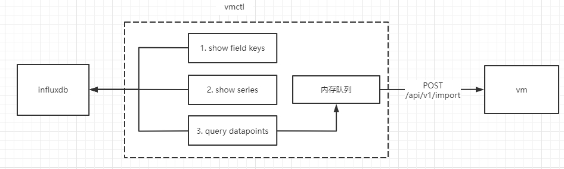
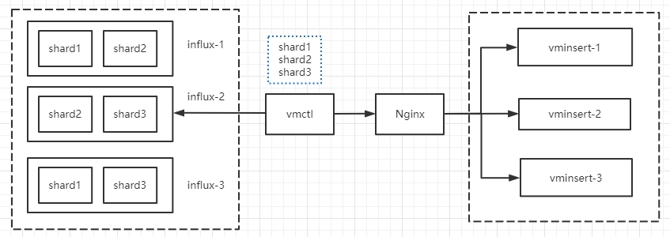

VictoriaMetrics提供了vmctl工具，支持将influxdb 1.*的数据迁移至vm。


### 一. 单机版：influxdb数据迁移至vm


#### 1. 源数据

influxdb总文件大小1.1GB:

```
# du -sh /var/lib/influx-data/
1.1G    /var/lib/influx-data/
```

数据源有3个shard：

```
# du -sh /var/lib/influx-data/data/prometheus/one_week/*
430M    /var/lib/influx-data/data/prometheus/one_week/10
319M    /var/lib/influx-data/data/prometheus/one_week/11
244M    /var/lib/influx-data/data/prometheus/one_week/9
```


vm和influxdb部署在同一个节点上，其数据为空。


#### 2. 迁移

配置：

* influxdb:
  * database和retention policy；
  * 4个并发goroutine； 
* vm：
  * 并发4个goroutine；

```
# ./vmctl-prod influx --influx-addr=http://10.21.1.74:8086 --influx-database=prometheus --influx-retention-policy=one_week --influx-concurrency=4 --vm-addr=http://10.21.1.74:8428 --vm-concurrency=4
InfluxDB import mode
2022/07/28 10:11:52 Exploring scheme for database "prometheus"
2022/07/28 10:11:52 fetching fields: command: "show field keys"; database: "prometheus"; retention: "one_week"
2022/07/28 10:11:52 found 926 fields
2022/07/28 10:11:52 fetching series: command: "show series"; database: "prometheus"; retention: "one_week"
2022/07/28 10:11:54 found 85636 series
Found 85636 timeseries to import. Continue? [Y/n] Y
54729 / 85636 [---------------------------------------------------------------------------------------------------------------------------------->___________________________________________________________________                     
54799 / 85636 [--------------------------------------------------------------------------------------------------------------------->_________________________________________________________________] 63.99%                            
85636 / 85636 [-----------------------------------------------------------------------------------------------------------------------------------------------------------------------------------------------------------] 100.00% 33 p/s
2022/07/28 10:55:32 Import finished!
2022/07/28 10:55:32 VictoriaMetrics importer stats:
  idle duration: 2h47m53.282475662s;
  time spent while importing: 43m31.127436333s;
  total samples: 194917933;
  samples/s: 74648.95;
  total bytes: 3.7 GB;
  bytes/s: 1.4 MB;
  import requests: 971;
  import requests retries: 0;
2022/07/28 10:55:32 Total time: 43m40.233121009s
```


迁移后的数据目录大小：

```
# du -sh /var/lib/vm-data/
178M    /var/lib/vm-data/

# du -sh /var/lib/vm-data/*
84K     /var/lib/vm-data/cache
150M    /var/lib/vm-data/data
0       /var/lib/vm-data/flock.lock
29M     /var/lib/vm-data/indexdb
4.0K    /var/lib/vm-data/metadata
0       /var/lib/vm-data/snapshots
0       /var/lib/vm-data/tmp
```


### 二. 迁移原理


vmctl的工作原理：

* 首先，向influxdb执行show field keys命令，查询所有的measurements及其field；
  * 查询field的目的，为查datapoints；
* 然后，向influxdb执行show series命令，查询所有的series；
* 其次，并发的通过M个goroutine，查询**各个**series下的所有datapoints，将其push到内存队列中；
* 最后，并发的通过N个goroutine，将内存队列中的datapoints**批量**的通过HTTP接口写入vm；




### 三. 集群版：influxdb数据迁移至vm


#### 1. 迁移思路

influxdb 3节点，迁移到vm 3节点。



迁移的思路：

* influxdb的数据按shard存储，假设集群有3个shard，每个shard有2个副本；
* vmctl迁移时，读到3个shard的单个副本即可，这样就拿到了集群全量的时序数据；
* vmctl写入vminsert时，由于是HTTP接口，通过Nginx将流量分散至3个vminsert；
* vminsert配置2副本，故最终写入vm集群的是2副本数据；


从迁移过程来看，vmctl仅需查询一个influxdb实例即可：

* 也就是说，使用一个vmctl查询一个influxdb实例，即可以得到全量的时序数据(单副本)；
* vmctl向集群其中一个influxdb实例执行：show field keys，可以得到集群所有的field数据；
* vmctl向集群其中一个influxdb实例执行：show series，可以得到集群所有的series数据；
* vmctl向集群其中一个influxdb实例查询某series对应的datapoints，可以得到该series在该集群下的所有datapoints；
  * 若该series的数据在当前节点，则查询当前节点，返回client；
  * 若该series的数据不在当前节点，则由该节点执行远程查询，然后再返回client；


#### 2. 迁移准备

influx-1:

```
# du -sh /var/lib/influxdb/
1.6G    /var/lib/influxdb/

# du -sh /var/lib//influxdb/data/prometheus/one_week/*
44K     /var/lib//influxdb/data/prometheus/one_week/11
44K     /var/lib//influxdb/data/prometheus/one_week/4
273M    /var/lib//influxdb/data/prometheus/one_week/5
393M    /var/lib//influxdb/data/prometheus/one_week/6
398M    /var/lib//influxdb/data/prometheus/one_week/7
440M    /var/lib//influxdb/data/prometheus/one_week/9
```

influx-2:

```
# du -sh /var/lib/influxdb/
837M    /var/lib/influxdb/

# du -sh /var/lib/influxdb/data/prometheus/one_week/*
131M    /var/lib/influxdb/data/prometheus/one_week/10
273M    /var/lib/influxdb/data/prometheus/one_week/5
397M    /var/lib/influxdb/data/prometheus/one_week/8
```

influx-3:

```
# du -sh /var/lib/influxdb/
1.8G    /var/lib/influxdb/

# du -sh /var/lib/influxdb/data/prometheus/one_week/*
131M    /var/lib/influxdb/data/prometheus/one_week/10
44K     /var/lib/influxdb/data/prometheus/one_week/11
44K     /var/lib/influxdb/data/prometheus/one_week/4
393M    /var/lib/influxdb/data/prometheus/one_week/6
398M    /var/lib/influxdb/data/prometheus/one_week/7
397M    /var/lib/influxdb/data/prometheus/one_week/8
440M    /var/lib/influxdb/data/prometheus/one_week/9
```


各shard的分布情况：

```
# influxd_ctl show-shards
ID      GroupID Database        RetentionPolcy  Replicas        Owners                          
4       2       prometheus      one_week        2               influx-3:8088,influx-1:8088     
5       3       prometheus      one_week        2               influx-1:8088,influx-2:8088     
6       4       prometheus      one_week        2               influx-3:8088,influx-1:8088     
7       5       prometheus      one_week        2               influx-3:8088,influx-1:8088     
8       6       prometheus      one_week        2               influx-2:8088,influx-3:8088     
9       7       prometheus      one_week        2               influx-3:8088,influx-1:8088     
10      8       prometheus      one_week        2               influx-2:8088,influx-3:8088     
11      9       prometheus      one_week        2               influx-3:8088,influx-1:8088    
```


vm的部署：

* vminsert-1/vmselect-1/vmstorage-1，与influx-1部署在同一个节点上；

* vminsert-2/vmselect-2/vmstorage-2，与influx-2部署在同一个节点上；

* vminsert-3/vmselect-3/vmstorage-3，与influx-3部署在同一个节点上；

  

#### 3. 迁移过程

配置：

* influxdb:
  * database和retention policy；
  * 4个并发goroutine； 
* vminsert：
  * 并发4个goroutine；
  * 通过LB分发流量；

```
# ./vmctl-prod influx --influx-addr=http://influx-3:8086 --influx-database=prometheus --influx-retention-policy=one_week --influx-concurrency=4 --vm-addr=http://influx-3:8080 --vm-concurrency=4 --vm-account-id=0 --verbose
InfluxDB import mode
2022/07/28 17:25:59 Exploring scheme for database "prometheus"
2022/07/28 17:25:59 fetching fields: command: "show field keys"; database: "prometheus"; retention: "one_week"
2022/07/28 17:26:00 found 937 fields
2022/07/28 17:26:00 fetching series: command: "show series"; database: "prometheus"; retention: "one_week"
2022/07/28 17:26:03 found 98668 series
Found 98668 timeseries to import. Continue? [Y/n] Y
98668 / 98668 [-----------------------------------------------------------------------------------------------------------------------------------------------------------------------------------------------------------] 100.00% 21 p/s
2022/07/28 18:42:39 Import finished!
2022/07/28 18:42:39 VictoriaMetrics importer stats:
  idle duration: 4h42m28.277739206s;
  time spent while importing: 1h16m34.795170802s;
  total samples: 552617019;
  samples/s: 120270.22;
  total bytes: 10.6 GB;
  bytes/s: 2.3 MB;
  import requests: 2724;
  import requests retries: 0;
2022/07/28 18:42:39 Total time: 1h16m39.89759127s
```

迁移后的数据目录大小：

vmstorage-1:

```
# du -sh /var/lib/vm/
219M    /var/lib/vm/

# du -sh /var/lib/vm/data/*
0       /var/lib/vm/data/big
0       /var/lib/vm/data/flock.lock
196M    /var/lib/vm/data/small
```

vmstorage-2:

```
# du -sh /var/lib/vm/
222M    /var/lib/vm/

#  du -sh /var/lib/vm/data/*
0       /var/lib/vm/data/big
0       /var/lib/vm/data/flock.lock
196M    /var/lib/vm/data/small
```

vmstorage-3:

```
# du -sh /var/lib/vm/
217M    /var/lib/vm/

# du -sh /var/lib/vm/data/*
59M     /var/lib/vm/data/big
0       /var/lib/vm/data/flock.lock
136M    /var/lib/vm/data/small
```


### 参考：

1.https://docs.victoriametrics.com/vmctl.html#migrating-data-from-influxdb-1x

