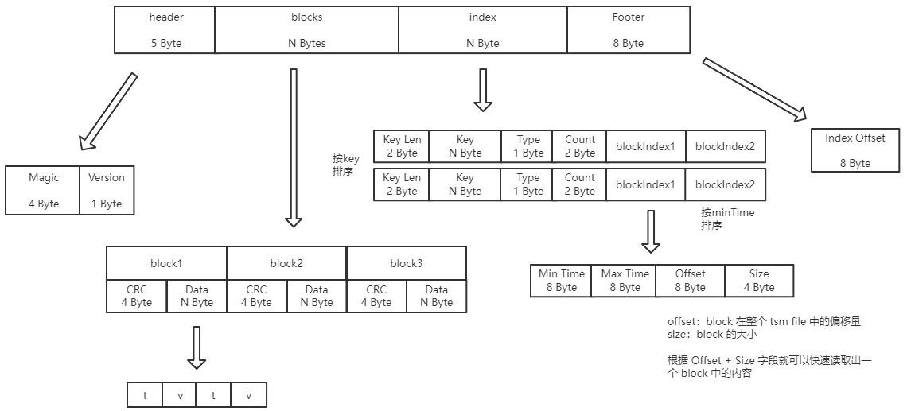
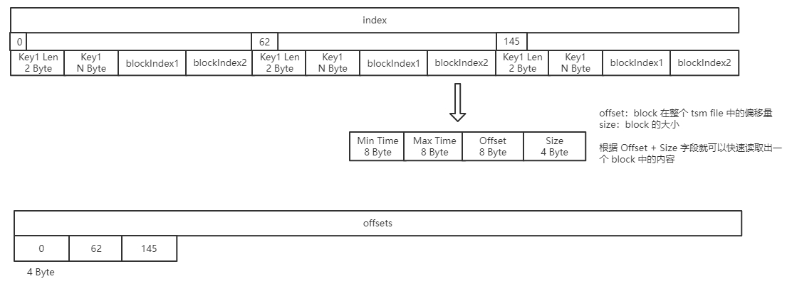
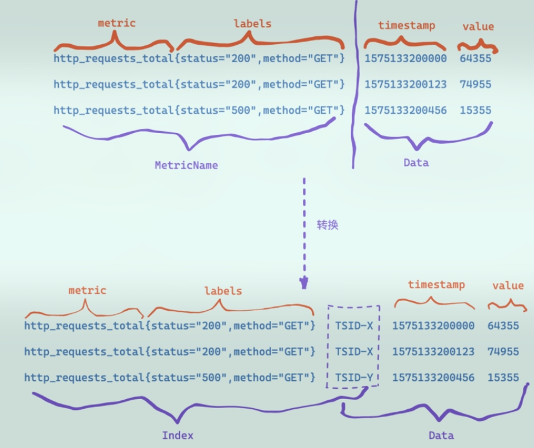
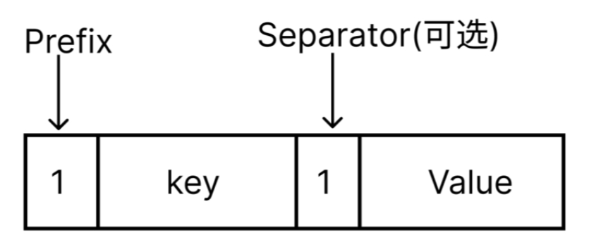
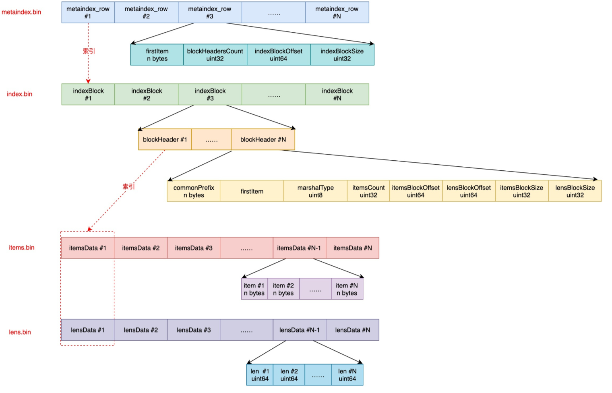
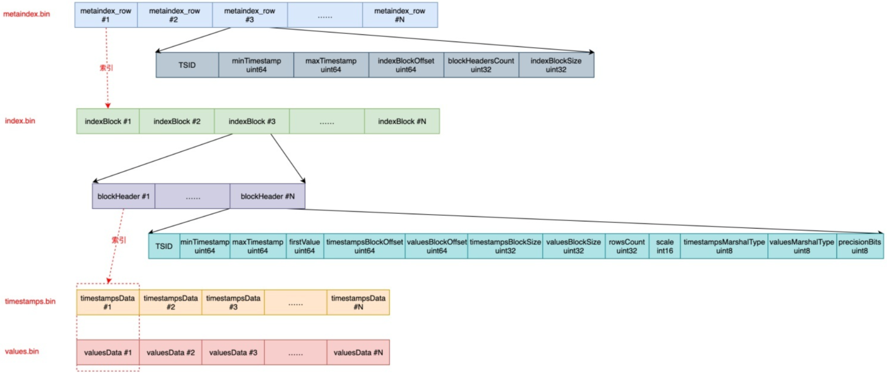

时序数据的查询和读取，与索引的结构息息相关，重点看一下索引结构，以及查询流程。


### 一. influxdb


#### 1. seriesKey

influxdb的行协议：

```
foo,tag1=value1,tag2=value2 field1=12,field2=40
bar,tag1=value3,tag2=value4 field1=34,field2=60
```

seriesKey 由measurement + tags kv + filedName组成；

若包含N个field，则分为多个key，比如field1，field2，则：

* key1 = measurement+ tags kv + field1

* key2 = measurement+ tags kv + field2

比如：
```
data: cpu_user,dstype=GAUGE,endpoint=monitor_server,step=60 ident="abc"
key:  cpu_user,dstype=GAUGE,endpoint=monitor_server,step=60**#!~#ident**
  
data: cpu_user,dstype=GAUGE,endpoint=monitor_server,step=60 value=66
key:  cpu_user,dstype=GAUGE,endpoint=monitor_server,step=60**#!~#value**
```


#### 2. 元数据索引

元数据索引存储在tsl文件中，其保存了:

```
measurement/tagkey=tagValue  ----> seriesKey
```

influxQL查询时，通常会传入timeRange、measurement、tagKey=tagValue，这样就很容易确定查询目标的seriesKey；

通过seriesKey，继续查询 内存索引 + 索引文件，可以得到最终的目标时序数据（下文中讲述）。


#### 3. 索引文件的结构

tsm file同时保存了data数据和index数据：

* header: 固定5Byte，包含version信息；
* blocks: 保存tv数据；
* index: 保存该部分tv数据的index；
  * index中包含若干个indexItem；
  * 每个indexItem包含每个seriesKey的索引，由若干个blockIndex组成，不同的blockIndex按minTime排序；
  * 每个blockIndex包含：
    * minTime/maxTime: block内时序数据的最小/最大时间；
    * offset：该block在整个tsm file中的offset；
    * size: 该block的大小；
    * 根据offset + set字段，可以快读读取出一个block中的内容；
* footer: 固定8Byte，保存index部分的offset；




#### 4. 内存的索引结构

为了提供查询效率，blockIndex信息被加载到内存，称为indirectIndex，其格式如下：

* offsets数据保存了index中每个key的偏移量；




#### 5. 查询过程

查询语句：

```
select value from "cpu_usage" where host='server01' and time > now() - 1h
```

查找过程：

* 根据时间：time > now() - 1h，得到目标shard；
* 在shard内，根据"cpu_usage"/tagKey="server01"，使用**元数据索引**，找到其seriesKey；
* 使用seriesKey，在**内存索引**中，二分查找其indexItem；
* 再根据minTime/maxTime，在indexItem中二分查询blockIndex；
* 根据blockIndex中的offset + size，得到tsm file的偏移量和大小，最后直接读取tsm file文件即可(顺序读)。


### 二. vm

指标被write到vm的时，有metric、label、timestamp、value，通过转换生成TSID：

* metric、lable、TSID保存到索引部分；
  * 用以按label进行检索；
* TSID、timestamp、value保存到数据部分；
  * timestamp、value各自使用列式压缩存储；



#### 1. TSID与Item

时序数据插入时，构造每条时序的TSID（若cache中不存在）；

通过**元数据索引**，可以使用tag查询到目标数据的TSID；

通过**索引文件**，可以使用TSID查询到目标数据；

```
type TSID struct {

	ProjectID uint32

	// MetricGroupID is the id of metric group inside the given project.
	//
	// MetricGroupID must be unique for the given (AccountID, ProjectID).
	//
	// Metric group contains metrics with the identical name like
	// 'memory_usage', 'http_requests', but with different
	// labels. For instance, the following metrics belong
	// to a metric group 'memory_usage':
	//
	//   memory_usage{datacenter="foo1", job="bar1", instance="baz1:1234"}
	//   memory_usage{datacenter="foo1", job="bar1", instance="baz2:1234"}
	//   memory_usage{datacenter="foo1", job="bar2", instance="baz1:1234"}
	//   memory_usage{datacenter="foo2", job="bar1", instance="baz2:1234"}
	MetricGroupID uint64

	// JobID is the id of an individual job (aka service)
	// for the given project.
	//
	// JobID must be unique for the given (AccountID, ProjectID).
	//
	// Service may consist of multiple instances.
	// See https://prometheus.io/docs/concepts/jobs_instances/ for details.
	JobID uint32

	// InstanceID is the id of an instance (aka process)
	// for the given project.
	//
	// InstanceID must be unique for the given (AccountID, ProjectID).
	//
	// See https://prometheus.io/docs/concepts/jobs_instances/ for details.
	InstanceID uint32

	// MetricID is the unique id of the metric (time series).
	//
	// All the other TSID fields may be obtained by MetricID.
	MetricID uint64
}
```

vm的索引文件都是围绕着item组织，item实际是一个keyvalue的字节数组，共有7中类型；

不同类型通过item的固定前缀来区分：



```
const (
	// Prefix for MetricName->TSID entries.
	nsPrefixMetricNameToTSID = 0

	// Prefix for Tag->MetricID entries.
	nsPrefixTagToMetricIDs = 1

	// Prefix for MetricID->TSID entries.
	nsPrefixMetricIDToTSID = 2

	// Prefix for MetricID->MetricName entries.
	nsPrefixMetricIDToMetricName = 3

	// Prefix for deleted MetricID entries.
	nsPrefixDeletedMetricID = 4

	// Prefix for Date->MetricID entries.
	nsPrefixDateToMetricID = 5

	// Prefix for (Date,Tag)->MetricID entries.
	nsPrefixDateTagToMetricIDs = 6
)
```


以写入如下的时序数据为例：

```
http_requests_total{status="200", method="GET"}		12
```

那么：

```
MetricName:	http_requests_total{status="200", method="GET"}
TSID:		{metricGroupID=0, jobID=0, instanceID=0, metricID=51106185174286}
```

生成的索引item:

```
## MetricName --> TSID
http_requests_total{status="200", method="GET"}
-->
{metricGroupID=0, jobID=0, instanceID=0, metricID=51106185174286}

## MetricID --> MetricName
51106185174286
-->
http_requests_total{status="200", method="GET"}

## metricID --> TSID
51106185174286
-->
{metricGroupID=0, jobID=0, instanceID=0, metricID=51106185174286}

## Tag --> MetricID
status="200" 					--> 	51106185174286
method="GET" 					--> 	51106185174286
__name__="http_request_total"	--> 	51106185174286
```


#### 2. 元数据索引

元数据索引文件，保存在indexdb目录；其结构如下：



metaindex.bin文件：

* 包含一系列的metaindex_row，每个metaindex_row包含fistItem、indexBlockOffset和indexBlockSize等；
  * indexBlockOffset和indexBlockSize用于索引indx.bin文件中的indexBlock；
* metaindex.bin文件被加载至内存，以提高查询速率；
* 查询时根据fistItem进行二分查找；

index.bin文件：

* 保存一系列的indexBlock，每个indexBlock包含一系列的blockHeader；
* 每个blockHeader包含firstItem和itemData，其中itemData包含：
  * itemsBlockOffset和itemsBlockSize用于索引item.bin文件；
  * lensBlockOffset和lensBlockSize用于索引lens.bin文件；
* 查询时，按照firstItem进行二分查找；

items.bin文件：

* 保存具体的item序列化后的数据；

lens.bin文件：

* 包含每个Item在item.bin文件中的length；


#### 3. 索引文件的结构

索引文件，与数据文件一样，保存在data目录；

```
# pwd
/var/lib/vm/data/small/2022_07/5865866_918_20220721090443.957_20220728085454.967_1705F8B219159EFB
# ls -alh
total 1.9M
drwxr-xr-x 2 root root  110 Jul 29 09:49 .
drwxr-xr-x 5 root root  102 Nov  8 09:47 ..
-rw-r--r-- 1 root root  13K Jul 29 09:49 index.bin
-rw-r--r-- 1 root root  102 Jul 29 09:49 metaindex.bin
-rw-r--r-- 1 root root    2 Jul 29 09:49 min_dedup_interval
-rw-r--r-- 1 root root 820K Jul 29 09:49 timestamps.bin
-rw-r--r-- 1 root root 1.1M Jul 29 09:49 values.bin
```

其结构如下：



metaindex.bin文件：

* 包含一系列的metaindex_row，每个metaindex_row包含TSID、minTimestamp、maxTimeStamp、indexBlockOffset、indexBlockSize等信息；
  * 其中indexBlockOffset和indexBlockSize用以索引index.bin文件；
* metaindex.bin文件的内容被读出加载到内存，以提高查询效率；
* 查找时根据TSID进行二分检索；

index.bin文件：

* 包含一系列的indexBlock，每个indexBlock包含一系列的blockHeader；
* 每个blockHeader包含TSID、minTimestamp、maxTimestamp、timestampsBlockOffset、timestampBlocksSize、valuesBlocksOffset、valuesBlocksSize；
  * 其中timestampsBlocksOffset、timestampsBlocksSize用以检索timestamps.bin文件；
  * 其中valuesBlocksOffset、valuesBlocksSize用以检索values.bin文件；

timestamps.bin文件：

* 保存timestamp的数据；

values.bin文件：

* 保存value的数据；


#### 4. 查询过程

比如，给定查询条件：

```
http_requests_total{status="200"}
```

查询过程：

* 首先，根据tag条件，到元数据索引中查询tag对应的metricID列表；
* 然后，计算所有满足所有tag的metricID的集合；
* 再后，根据metircID，到元数据索引中查询TSID集合；
* 最后，根据TSID集合，到数据索引中查找timestamp/value数据；


### 三. 对比


对于influxdb和vm的索引结构和查询过程，它们的相同点：

* 索引结构，均包含元数据索引文件和数据索引文件；
* 查询过程，均先查询元数据索引，再根据key查询数据索引文件，最后读取数据文件；


vm相比influxdb，其查询速度更快，主要原因：

* vm的数据文件分为timestamp和value文件，可以进行并发的顺序读取；
  * 而influxdb由于是timestamp和value存放在同一个文件中，只能顺序读取；
* influxdb的shard存放一段时间的数据，该shard固定在某个节点上，当查询时，只能对该节点进行查询；
  * 而vm的series分散在不同的节点上，可以并发查询、并发读取；
* vm在query的查询实现中，使用了cache：
  * 将PromQL表达式的解析结果存放至cache，当hit相同的PromQL时，不用再次经过PromQL引擎的解析；


