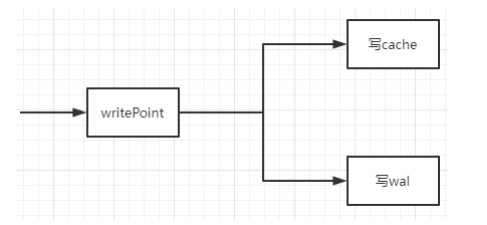

InfluxDB存储引擎目前是TSM(Time Structed Merge Tree)，本质是LSM(Log Strutured Merge Tree)，针对数据查询、压缩、清洗做了优化。


VM存储引擎也是基于LSM，适应写多读少、连续读的场景。


### 一. influxDB的写入


#### 1. 写入



写数据是，写入cache和wal后，就返回client：

* wal保证了宕机重启后，数据可以恢复；
* cache的数据，会被后台的compact线程定期的保存到磁盘；
  * 值得注意的是，cache保存的是原始数据；


#### 2. cache压缩成tsm file

后台线程，每隔1s检查cache是否可以压缩，只要下面其中一个条件满足：

* cache太大了：默认=25MB，可以在配置文件更改；
* 很长时间没有写操作：默认=10min，可以在配置文件更改；

```
func (e *Engine) ShouldCompactCache(t time.Time) bool {
    sz := e.Cache.Size()    
    if sz > e.CacheFlushMemorySizeThreshold {	//CacheFlushMemorySizeThreshold，默认=25MB
        return true
    }
    return t.Sub(e.Cache.LastWriteTime()) > e.CacheFlushWriteColdDuration	//CacheFlushWriteColdDuration，默认=10min
}
```

压缩过程：

* 按照2e6的大小分为N个块，并发进行压缩，压缩后的数据写入tsm file；
  * 由于influxdb的value支持float/int/bool/string等类型，针对不同的数据类型，使用不同的压缩算法；
* 压缩完成后，需要删除wal文件；


```
card := cache.Count()
concurrency := card / 2e6
splits := cache.Split(concurrency)
```


压缩算法：

* Timestamp: simple8b算法；
* Float: XOR算法；
* Integer: Zigzag算法；
  * 对小整数的压缩效果较好(包括正数和负数)；

* String: Snappy算法；
* Bool: 0/1bit存储；


#### 3. tsm file的compact

后台线程，每隔1s检查，检查可以compact的tsm files；

同level的N个tsm file，可以被合并为1个level+1的tsm file；compact减少了文件的个数，提高顺序I/O的读效率；

compact仅涉及数据文件的合并，不涉及压缩。


LSM通常会有“写放大”的问题，在Compact的过程中，一份数据不停的被Merge到下一个Level；这就导致一份数据，被来回的读取->写入磁盘多次，该现象称为“写放大”。

为避免“写放大”，influxdb的compact的算法：

* 限制compact Level最大=4；
* 同时，对level中执行compact的文件个数进行限制：
  * level=1时，最少8个文件一起合并；
  * level>1时，最少4个文件一起合并；

```
func (c *DefaultPlanner) PlanLevel(level int) []CompactionGroup {
	...
	minGenerations := 4
    if level == 1 {
        minGenerations = 8
    }
    ...
}
```

同时，在1次compact中，只能选择1个level的N个文件compact；当多个level都可以进行compact时，使用权重选择其中1个level：

```
var defaultWeights = [4]float64{0.4, 0.3, 0.2, 0.1}

func (s *scheduler) next() (int, bool) {
    ...
    var weight float64
    for i := 0; i < end; i++ {
        if float64(s.queues[i])*s.weights[i] > weight {
            level, runnable = i+1, true
            weight = float64(s.queues[i]) * s.weights[i]
        }
    }
    return level, runnable
}
```


### 二. vm的写入


#### 1. 数据目录

data目录保存指标数据，包含small和big目录：

* small目录保存最近写入的数据；
  * 目录按月分为若干个partition，每个partition保存1个月内写入的数据，比如2022_07；
  * 每个partition下包含若干个part，每个part均保存最近写入的数据；
  * part的命名规则：rowsCount_blocksCount_minTime_maxTime_timeHex；
* big目录保存远期数据；


####  2. 数据目录

* partition对应一个目录，存放一个月的数据
* smallParts对应small目录，存放最近写入的数据；
* bigParts对应big目录，存放时间较远的数据；


```
type partition struct {
    ...
    smallParts []*partWrapper

    bigParts []*partWrapper

	rawRows rawRowsShards
    ...
}
```

保存到磁盘中的part，由time/value/index/metaindex等文件构成：

```
# ls -alh small/2022_07/9198703_147390_20220708021944.621_20220708032254.348_16FF7D342AC6BA17/
总用量 6.3M
drwxr-xr-x 2 root root  110 7月  19 10:37 .
drwxr-xr-x 5 root root  105 7月  21 18:04 ..
-rw-r--r-- 1 root root 2.0M 7月   8 11:23 index.bin
-rw-r--r-- 1 root root 4.3K 7月   8 11:23 metaindex.bin
-rw-r--r-- 1 root root    2 7月   8 11:23 min_dedup_interval
-rw-r--r-- 1 root root 732K 7月   8 11:23 timestamps.bin
-rw-r--r-- 1 root root 3.6M 7月   8 11:23 values.bin
```


#### 2. 写入和压缩

* 数据写入时，**写入内存shard即返回**client；
  * 每个shard存放1w~50w条数据

```
var rawRowsShardsPerPartition = (cgroup.AvailableCPUs() + 3) / 4

func getMaxRawRowsPerShard() int {
    maxRawRowsPerPartitionOnce.Do(func() {
        n := memory.Allowed() / rawRowsShardsPerPartition / 256 / int(unsafe.Sizeof(rawRow{}))
        if n < 1e4 {
            n = 1e4
        }
        if n > 500e3 {
            n = 500e3
        }
        maxRawRowsPerPartition = n
    })
    return maxRawRowsPerPartition
}
```

* shard内数据，每隔1s，以8K rows为一组(block)，将其flush到inmemoryPart(内存)；

```
func (pt *partition) rawRowsFlusher() {
    ticker := time.NewTicker(rawRowsFlushInterval)    // 常量=1s
    defer ticker.Stop()
    for {
        select {
        case <-pt.stopCh:
            return
        case <-ticker.C:
            pt.flushRawRows(false)
        }
    }
}
```


shard和inmemoryPart的数据都在内存，由于没有wal，导致宕机丢失。


shard内数据flush到inmemoryPart过程中，会进行压缩：

  * 压缩主要针对timestamp和value，time是[]int64，value是[]float64；
  * 将value的[]float64转换为scale+[]int64；

  ```
  比如，输入：{1.2, 3.4, 5, 6, 7.8}
  	 输出：{12, 34, 50, 60, 78}，scale=-1
  ```

  * 此时，timestamp和value均为[]int64，使用相同的压缩流程：
    * 若[]int64都是相同的值，则保存第一个值即可，header中记录压缩类型=MarshalTypeConst；
    * 若[]int64是delta相同的等差数列，则保存第一个值和delta，header中记录压缩类型=MarshalTypeDeltaConst；
    * 若[]int64的值为Gauge，即随机变化的值，则先计算delta value，然后使用zig-zag压缩；
      * header中记录压缩类型=MarshalTypeZSTDNearestDelta；
      * 结果为：**zig-zag(v0, v1-v0, v2-v1,.....)**
    * 若[]int64的值是Counter，即不断增长的值，则先计算delta of delta，然后使用zig-zag进行压缩；
      * header中记录压缩类型=MarshalTypeZSTDNearestDelta2；
      * 结果为：**zig-zag(v0, v1-v0, (v2-v1)-(v1-v0),.....)**
    * 最后使用[zstd](https://github.com/facebook/zstd)对结果进行二次压缩；
      * zstd是facebook开源的无损的、实时(real-time)的zlib级别的压缩算法；


inmemoryPart(内存)的数据，每隔5s，以15个inmemoryPart为一组，合并后刷入磁盘的small目录；

```
func (pt *partition) inmemoryPartsFlusher() {
    ticker := time.NewTicker(inmemoryPartsFlushInterval)    //常量=5秒
    defer ticker.Stop()
    var pwsBuf []*partWrapper
    var err error
    for {
        select {
        case <-pt.stopCh:
            return
        case <-ticker.C:
            pwsBuf, err = pt.flushInmemoryParts(pwsBuf[:0], false)
            ...
        }
    }
}
```


shard和inmemoryPart的数据都在内存，由于没有wal，导致节点宕机时，出现丢失；

在集群模式下，由于多节点写入(--replicationFactor)和多节点读取，故可以容忍写入时部分节点宕机。


#### 3. 合并

定期(10s)检查small目录的part，以15个为一组，合并到1个新目录。

仅涉及数据文件的合并，**不涉及压缩**。


合并的步骤：

* 首先，从smallParts[]中筛选最多15个part进行合并；筛选的算法：(目标，减小“写放大”)
  * 将所有parts按(size, minTimestamp)排序；
  * 从parts中寻找一段连续的parts，返回**m**最大的连续parts：
    * m=(连续parts的sumSize / 连续parts最后一个part的size)，即筛选出连续的size差别不大的part；
    * 要求maxM > min(len(parts), 15) / 2，即必须超过一半；
* 然后，计算筛选后的sumSize，若sumSize>(剩余内存/15)，则merge到bitPart，否则merge到smallPart；
  * 即内存足够充裕时，优先merge到bigPart，否则merge到smallPart；


### 三. 压缩对比


* 压缩率：
  * influxdb对timestamp和value只进行了1次压缩；
  * vm进行两次压缩，第1次是对[]int64的压缩，第2次对第1次压缩的的结果，再使用zstd进行2次压缩，压缩率更高；
* 数据文件：
  * influxdb的timestamp和value压缩后保存在一个文件中，格式：k-v-padding::k-v:padding::...，对于对齐的因素，中间需要填充Padding；
  * vm的timestamp压缩后保存在timestamps.bin，value压缩后保存在values.bin，相比influxdb，没有padding，压缩率更高；

* 数据类型：
  * influxdb的timestamp使用simple8b压缩；value支持float/int/string等类型，对不同的类型使用不同的压缩算法；由于压缩算法的差异，可能达不到最大的压缩效果；
  * vm的timestamp和value统一转换成[]int64进行压缩，压缩时充分考虑各种不同的场景，最大化压缩效率；
* 文件内容：
  * influxdb的tsm file中除了包含timestamp/value数据，还包含index数据；
    * 导致一段时间内的N个tsm file，包含相同的index数据，重复存储；
  * vm的timestamp/value数据文件与index文件分别存储；


### 四. 附zig-zag算法


zigzag算法认为大多数情况下，我们使用的数字都是不大的，其原理是：

* 将原始值左移1bit，得到X1；
* 将原始值的最高位移至最低位，得到X2；
* X1^X2=C，将C存入；

由于小的数值前导位都是0，故X1^X2将是一个很小的数值。


实现的代码，src []int64为待编码数字：

* 首先，遍历src []int64，保留第一个值，依次计算与preValue的delta；
* 然后，对差值进使用zig-zag编码；

```
func marshalInt64NearestDelta(dst []byte, src []int64, precisionBits uint8) (result []byte, firstValue int64) {
	...
	firstValue = src[0]
	v := src[0]
	src = src[1:]
	is := GetInt64s(len(src))	//Get from bufferPool
	if precisionBits == 64 {
		// Fast path.
		for i, next := range src {		//计算与前值的delta
			d := next - v
			v += d
			is.A[i] = d
		}
	} else {
		...
	}
	dst = MarshalVarInt64s(dst, is.A)
	PutInt64s(is)			// Retrun to bufferPool
	return dst, firstValue
}
```

zig-zag编码的实现代码：

* 计算v=(v左移1位) xor (v右移63位)；
* 将v的有效非0字节存入结果[]byte；

```
func MarshalVarInt64s(dst []byte, vs []int64) []byte {
	for _, v := range vs {
		...
		v = (v << 1) ^ (v >> 63) // zig-zag encoding without branching.
		u := uint64(v)
		for u > 0x7f {
			dst = append(dst, 0x80|byte(u))
			u >>= 7
		}
		dst = append(dst, byte(u))
	}
	return dst
}
```

