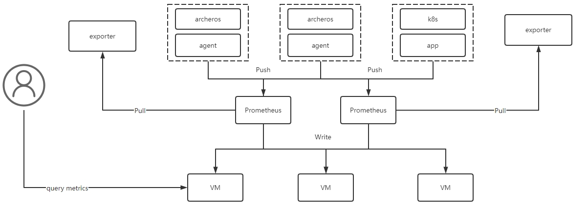

### 一. 背景

目前的监控告警模块，存在以下问题：

* 新增组件的监控，需要额外开发agent功能，采集组件监控数据，上报给open-falcon模块；
* TSDB使用自研的InfluxDB集群版本，当插入指标量大后，InfluxDB的CPU/Memory有明显的飙升；
* 当前的告警模块，需要创建监控项、告警模板、告警项目以后才能告警，用户的操作较为复杂；

针对以上问题：

* 引入Prometheus作为采集端，即可以支持Agent Push，也可以支持采集exporter，融入开源生态；
* 引入Prometheus作为告警评估的后端，同时以PrometheusRule作为标准的告警规则定义；
* 引入VM作为稳定的TSDB，相比InfluxDB，其在数据的查询和写入上，性能更加强劲；

### 二. 方案

从指标和告警两方面进行描述。

#### 1. 指标

Prometheus指标采集：

* 对于ArcherOS，目前采用agent push到CM，修改为agent push到Prometheus；
  * 需要修改agent push的消息格式；
* 对于Kubernetes，目前采用remote write到CM，修改为write到Prometheus；
* Prometheus可以Pull各种exporter的指标；
  * 对于新增组件，提供exporter即可；

VM指标查询和存储：

* Prometheus的指标可以Write到VM，提供稳定的TSDB集群存储；
* VM支持PromQL格式的查询请求，查询性能强大；

#### 2. 告警

告警流程：

* 用户插入告警规则，后端将其转换为PrometheusRule存储在MySQL；
* Prometheus进行reload，加载新创建的PrometheusRule；
* 当指标触发告警时，Prometheus将告警发送到Alertmanager；
* 后端接收Alertmanager告警信息，将告警存储至MySQL；
* 利用Alertmanager的告警通知功能，将告警通过Email/Dingding/Wechat等发送给用户；

