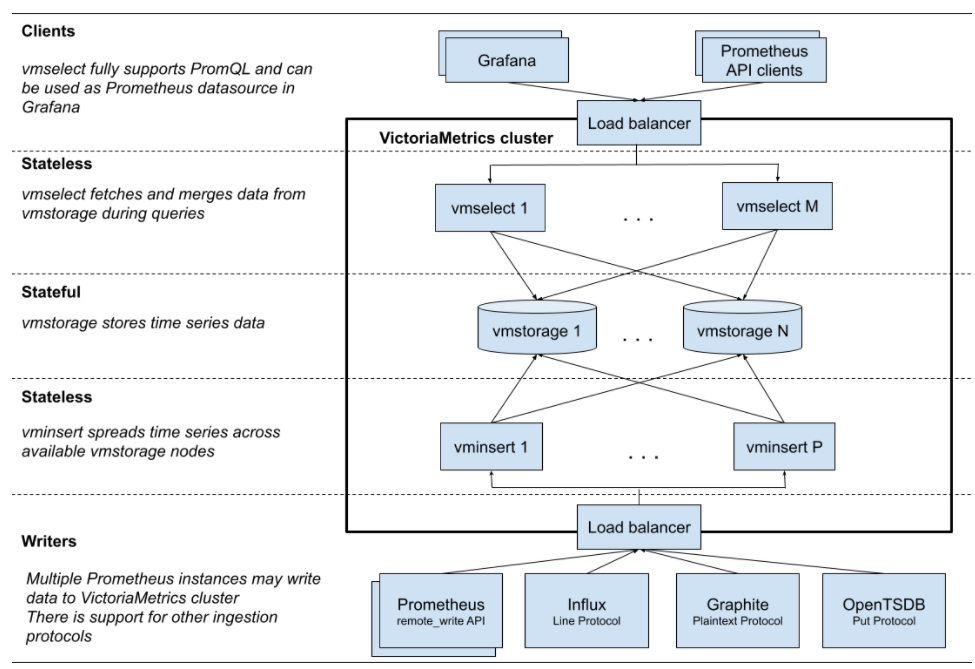
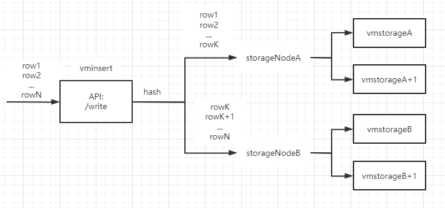
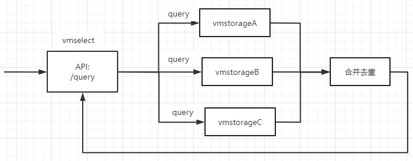

###  1.victoriametrics概述

victoriametrics是一个快速、高效和可扩展的时序数据库，可作为prometheus的长期存储。

victoriametrics支持PromQL查询语言，也支持Influxdb行协议，对当前主流的时序协议支持比较好。


本文重点关注其集群架构。



单实例的victoriametric只有一个进程。

集群版的victoriametrics有3类进程，即3类微服务组成：

* vmstorage: 数据存储节点，负责存储时序数据；
* vmselect: 数据查询节点，负责接收用户查询请求，向vmstorage查询时序数据；
* vminsert: 数据插入节点，负责接收用户插入请求，向vmstorage写入时序数据；

在部署时可以按照需求，不同的微服务部署不同的副本，以应对业务需求：

* 若数据量比较大，部署较多的vmstorage副本；
* 若查询请求比较多，部署较多的vmselect副本；
* 若插入请求比较多，部署较多的vminsert副本；


### 2. victoriametrics 集群实现

集群中vmselect、vminsert节点都是无状态的，唯一有状态的是vmstorage。

vmstorage的多节点采用[shared noting architecture](https://en.wikipedia.org/wiki/Shared-nothing_architecture)，各节点间不共享数据，也不知道彼此的存在。

> `vmstorage` nodes don't know about each other, don't communicate with each other and don't share any data. This is [shared nothing architecture](https://en.wikipedia.org/wiki/Shared-nothing_architecture). It increases cluster availability, simplifies cluster maintenance and cluster scaling.


为保证时序数据的可用性，采用复制的方法，即每份数据存入N个不同的节点，在查询时，同时查询多个节点，去重后返回给client。

具体来说，若设置--replicationFactor=2，即数据副本=2：

在写入数据时：

* 对输入数据进行一致性hash计算，将写入storageIndex节点；
* 由于配置写入2副本，它同时要写入storageIndex+1节点；

在查询数据时：

* 向所有的vmstorage发起查询；
* 将查询结果合并、去重后，返回给client；


### 3.victoriametrics 写入数据

以InfluxDB行协议插入数据为例，结合源码分析victoriametrics集群版本写入数据的流程。

写入数据在vminsert服务中处理，假设--replicationFactor=2，即数据副本=2：



插入时：

* 对每条时序数据，按照其lable计算一致性hash值，作为它存入的目标节点，假设为storageNodeA；

* 对于该条时序数据，由于副本=2，它将被写入storageNodeA和storageNodeA +1两个vmstorage节点；

  

#### 1）API入口

API: influx/write

```go
// app/vminsert/main.go
func requestHandler(w http.ResponseWriter, r *http.Request) bool {
    ......
    switch p.Suffix {
    case "influx/write", "influx/api/v2/write":
        if err := influx.InsertHandlerForHTTP(at, r); err != nil {
            httpserver.Errorf(w, r, "%s", err)
            return true
        }
        w.WriteHeader(http.StatusNoContent)
        return true
    }
    ......
}
```

API handler:

```go
// app/vminsert/influx/request_handler.go
func InsertHandlerForHTTP(at *auth.Token, req *http.Request) error {
    extraLabels, err := parserCommon.GetExtraLabels(req)
    if err != nil {
        return err
    }
    //限流执行
    return writeconcurrencylimiter.Do(func() error {
        isGzipped := req.Header.Get("Content-Encoding") == "gzip"
        q := req.URL.Query()
        precision := q.Get("precision")
        // Read db tag from https://docs.influxdata.com/influxdb/v1.7/tools/api/#write-http-endpoint
        db := q.Get("db")
        return parser.ParseStream(req.Body, isGzipped, precision, db, func(db string, rows []parser.Row) error {
            return insertRows(at, db, rows, extraLabels, false)
        })
    })
}
```

可以看到，API handler中做了限流。


#### 2）一致性hash

遍历每条时序数据，根据其label，计算一致性hash值，作为存入的目标节点：

```
// app/vminsert/influx/request_handler.go
func insertRows(at *auth.Token, db string, rows []parser.Row, extraLabels []prompbmarshal.Label, mayOverrideAccountProjectID bool) error {
    ic := &ctx.Common
    atCopy := *at
    for i := range rows {
        r := &rows[i]           
        ......
        ic.MetricNameBuf = storage.MarshalMetricNameRaw(ic.MetricNameBuf[:0], atCopy.AccountID, atCopy.ProjectID, ic.Labels)    
        for j := range r.Fields {
            f := &r.Fields[j]    
            ...        
            metricGroup := bytesutil.ToUnsafeString(ctx.metricGroupBuf)
            ic.Labels = ic.Labels[:labelsLen]        
            ic.MetricNameBuf = storage.MarshalMetricLabelRaw(ic.MetricNameBuf, &ic.Labels[len(ic.Labels)-1])
            // 一致性hash: 计算storageIdx
            storageNodeIdx := ic.GetStorageNodeIdx(&atCopy, ic.Labels)
            // 每个时序数据写入对应的ctx.bufRowss[storageIdx]
            if err := ic.WriteDataPointExt(&atCopy, storageNodeIdx, ic.MetricNameBuf, r.Timestamp, f.Value); err != nil {
                return err
            }
        }
    }
    ......
}
```

一致性hash计算storageIdx的代码：jump_hash算法

```go
// app/vminsert/netstorage/insert_ctx.go
func (ctx *InsertCtx) GetStorageNodeIdx(at *auth.Token, labels []prompb.Label) int {
    ......
    buf := ctx.labelsBuf[:0]
    buf = encoding.MarshalUint32(buf, at.AccountID)
    buf = encoding.MarshalUint32(buf, at.ProjectID)
    for i := range labels {
        label := &labels[i]
        buf = marshalBytesFast(buf, label.Name)
        buf = marshalBytesFast(buf, label.Value)
    }
    h := xxhash.Sum64(buf)    //计算hash值
    ctx.labelsBuf = buf
    idx := int(jump.Hash(h, int32(len(storageNodes))))    //得到storageIdx
    return idx
}
```


#### 3) 写入多节点

写入流程：

* 若配置多个副本，则将数据发送至多个storageNode；
  * 对单个storageNode，通过sn.esendBufRowsNonBlocking()发送：
  * 若发送成功，则跳出内层for；
  * 否则，尝试发送至idx++节点；
  * 若尝试了所有节点后，则直接返回；

```go
// app/vminsert/netstorage/netstorage.go
func sendBufToReplicasNonblocking(br *bufRows, snIdx, replicas int) bool {
    usedStorageNodes := make(map[*storageNode]bool, replicas)
    for i := 0; i < replicas; i++ {    //多个副本，发送至多个storageNode
        idx := snIdx + i
        attempts := 0
        for {
            attempts++
            if attempts > len(storageNodes) {    //已尝试了所有节点
                if i == 0 {
                    return false    //第一个副本就失败了，返回false
                }
                return true
            }
            sn := storageNodes[idx]
            idx++
            //发送
            if !sn.sendBufRowsNonblocking(br) {
                continue    //若失败，则尝试下一个节点idx++
            }
            break    //成功就返回
        }
    }
    return true
}
```


### 4.victoriametrics 查询数据

以PromQL查询数据为例，结合源码分析victoriametrics集群版本查询数据数据的流程。

查询数据在vmselect服务中处理，假设--replicationFactor=2，即数据副本=2：



查询时：

* 向N个vmstorage节点查询时序数据(N为vminsert启动时配置的vmstorage参数)；
* 数据返回后，经过合并去重，返回给client；


#### 1）API入口

```go
// app/vmselect/main.go
func selectHandler(startTime time.Time, w http.ResponseWriter, r *http.Request, p *httpserver.Path, at *auth.Token) bool {
    ......
    switch p.Suffix {
    ......
    case "prometheus/api/v1/query_range":
        if err := prometheus.QueryRangeHandler(startTime, at, w, r); err != nil {
            sendPrometheusError(w, r, err)
            return true
        }
        return true
    }
    ......
}
```


#### 2）并发向storageNode查询

并发的向所有storageNode发起查询，为每个storageNode分配1个goroutine：

```go
// app/vmselect/netstorage/netstorage.go
func startStorageNodesRequest(denyPartialResponse bool, f func(idx int, sn *storageNode) interface{}) *storageNodesRequest {
    resultsCh := make(chan interface{}, len(storageNodes))
    for idx, sn := range storageNodes {
        // 每个storageNode分配一个goroutine
        go func(idx int, sn *storageNode) {
            result := f(idx, sn)
            resultsCh <- result    //将结果放入chan
        }(idx, sn)
    }
    return &storageNodesRequest{
        denyPartialResponse: denyPartialResponse,
        resultsCh:           resultsCh,
    }
}
```


#### 3）返回查询结果

正常情况下，同一个series的指标数据，使用jumphash会固定存储在同一个节点上；

但是，由于网络抖动和接口出错等原因，原本存储在storageIdx上的数据，可能会被存储到storageIdx+1节点上。

基于以上原因，如果只有一部分storageNode返回数据，那结果可能是isPartial的数据。

最终结果的判断原则：

* 最完美的情况：
  * 所有节点都正常返回且没有错误，则认为结果时完整且没有错误的：
* 若正常返回的结果 > len(storageNode) - replicaFactor：
  * 则被判定为数据完整且没有错误，直接返回；
  * 比如3个节点，replica=2，只要>=2个节点正常返回，则认为结果数据是完整的
* 若所有节点都出错了：
  * 则认为结果是错误的，并返回第1个错误
* 若部分节点返回错误：
  * 则认为结果是不完整的：

```
// app/vmselect/netstorage/netstorage.go
func (snr *storageNodesRequest) collectResults(partialResultsCounter *metrics.Counter, f func(result interface{}) error) (bool, error) {
    var errors []error
    resultsCollected := 0
    for i := 0; i < len(storageNodes); i++ {
        result := <-snr.resultsCh    //返回结果
        if err := f(result); err != nil {
            errors = append(errors, err)
            continue
        }
        resultsCollected++
        // 判定为数据完整且没有错误，直接返回
        if resultsCollected > len(storageNodes)-*replicationFactor {
            return false, nil
        }
    }
    isPartial := false
    if len(errors) > 0 {
        // 所有结果都出错了，返回第一个错误
        if len(errors) == len(storageNodes) {
            return false, errors[0]
        }
        isPartial = true
    }
    return isPartial, nil
}
```


### 5.victoriametrics VS influxdb


#### 1）测试方法

victoriametrics和Influxdb均支持remote-write协议，将kubernetes集群的指标通过remote-write同时写入victoriametrics和Influxdb，对比其：

* cpu使用率；
* 内存使用量；
* 存储使用量；

victoriametrics和Influxdb均使用单机版部署，运行时间：18hour左右。


#### 2）对比CPU使用率

* influxdb的cpu使用率，大概在35%左右；
* victoriametrics的cpu使用率，大概在12%左右；
* 整体上，influxdb的cpu使用率，高于victoriametrics;


#### 3）对比Mem使用量

* Influxdb的mem使用量，大概在1.2G左右；
* victoriametrics的mem使用量，大概在320M左右；


#### 4）对此Disk使用量

对比存储时序数据后，其Disk使用量：

* influxdb的磁盘占用总量≈1.2G；
* victoriametrics的磁盘占用总量≈300M；

```
## influxdb
# du -sh /var/lib/influxdb/*
1.2G    /var/lib/influxdb/data
4.0K    /var/lib/influxdb/influxd.pid
4.0K    /var/lib/influxdb/meta
12M     /var/lib/influxdb/wal

## victoriametrics
# du -sh ./victoria-metrics-data/*
219M    ./victoria-metrics-data/data
0       ./victoria-metrics-data/flock.lock
40M     ./victoria-metrics-data/indexdb
4.0K    ./victoria-metrics-data/metadata
0       ./victoria-metrics-data/snapshots
0       ./victoria-metrics-data/tmp
```


### 参考

1. victoriametrics集群doc: https://docs.victoriametrics.com/Cluster-VictoriaMetrics.html
2. Influxdb行协议：https://docs.influxdata.com/influxdb/v1.7/write_protocols/line_protocol_tutorial/
3. victoriametircs与Influxdb性能对比：https://medium.com/@valyala/insert-benchmarks-with-inch-influxdb-vs-victoriametrics-e31a41ae2893